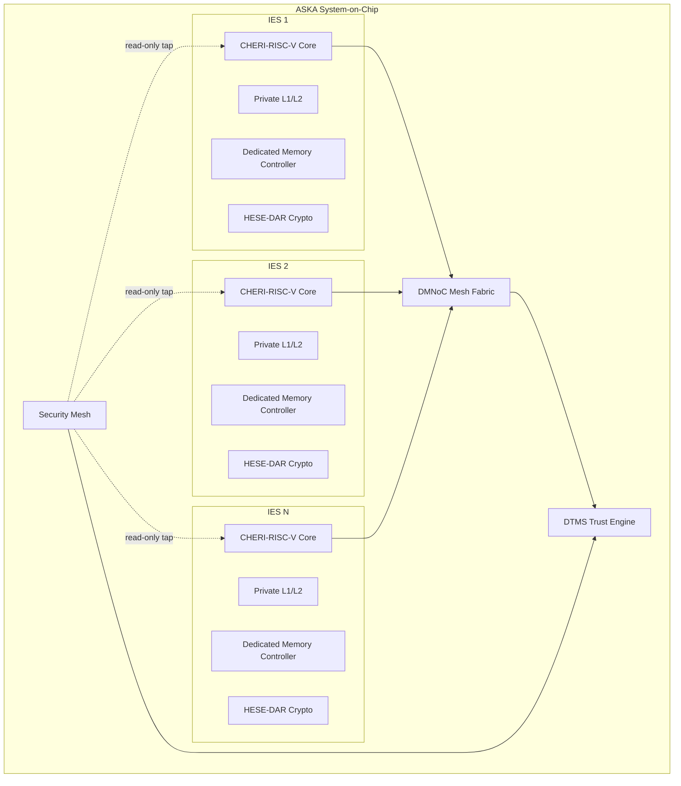
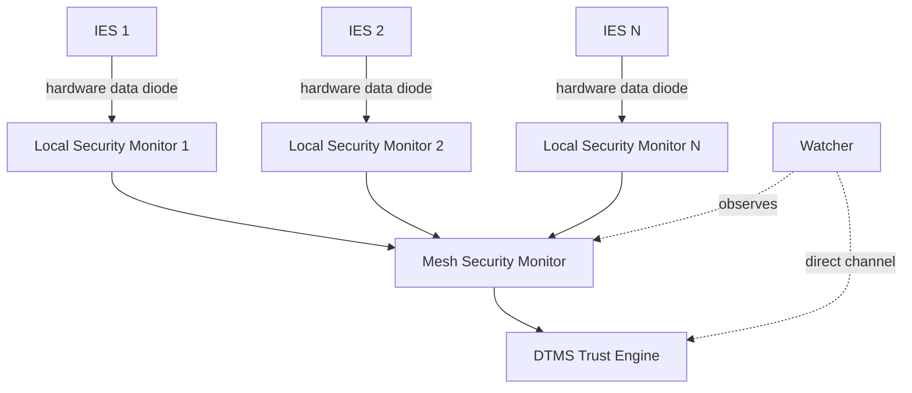
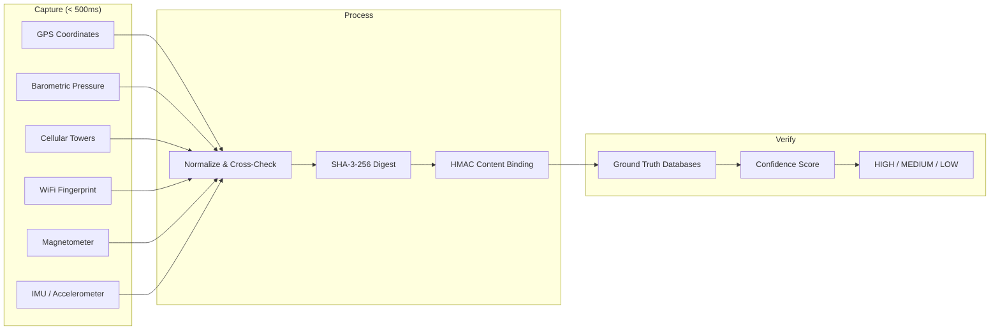

## The Problem: Shared Silicon Is Broken

Every major Trusted Execution Environment shares silicon substrate with untrusted code. This is not a bug --- it is an architectural inevitability. Shared caches, shared power delivery, shared memory controllers, and shared execution units create permanent leakage channels that cannot be patched away.

**Twelve major TEE compromises in seven years:**

| Year | Attack | Target | Root Cause |
|------|--------|--------|------------|
| 2018 | Foreshadow | Intel SGX | Shared L1 cache |
| 2018 | SEVered | AMD SEV | Shared memory controller |
| 2019 | Plundervolt | Intel SGX | Shared voltage regulator |
| 2020 | PLATYPUS | Intel SGX | Shared power interface |
| 2021 | CacheOut | Intel SGX | Shared L1 cache |
| 2022 | AEPIC Leak | Intel SGX | Shared APIC MMIO |
| 2023 | Downfall (GDS) | Intel TDX | Shared gather unit |
| 2023 | CacheWarp | AMD SEV-SNP | Shared cache |
| 2023 | Inception | AMD SEV | Shared branch predictor |
| 2024 | GoFetch | Apple M-series | Shared DMP |
| 2024 | TDXShadow | Intel TDX | Shared page tables |
| 2024 | Hertzbleed | Intel/AMD | Shared frequency scaling |

The pace is accelerating. Every patch addresses a specific channel while the structural problem remains: **shared substrate means shared observation**.

Physics cannot be patched. Cache timing, power analysis, microarchitectural leakage, and electromagnetic emanation are consequences of electrons flowing through shared conductors. No software update changes the laws of electromagnetism.

---

## The Solution: Physical Isolation

ASKA takes a fundamentally different approach. Instead of trying to hide secrets on shared silicon, ASKA gives every trust domain its own physically separate hardware:

- **Dedicated CPU cores** per trust domain (no shared pipeline, no shared branch predictor)
- **Private cache hierarchy** (no shared L1, L2, or LLC --- no Prime+Probe, no Flush+Reload)
- **Dedicated memory controller and DRAM banks** (no shared memory bus, no Rowhammer across domains)
- **Independent voltage regulator** per domain (no power analysis across domains)
- **Independent clock with per-domain PLL** (no clock-based covert channels)

This costs 3--5x silicon area compared to conventional multi-tenant designs. That is the trade-off. ASKA is not for workloads where "good enough" security suffices. It is for environments where a single breach costs millions or lives: defense, critical infrastructure, financial systems, and high-assurance AI.

---

## Architecture

ASKA comprises four core subsystems. Each enforces security in hardware --- software configures policy, but hardware enforces it.



### IES: Isolated Execution Stacks

An IES is a physically self-contained compute unit. Every workload runs inside an IES. There is no shared substrate between IES units for voltage, clock, cache, memory controller, or TLB.

**What an IES contains:**

| Component | Purpose |
|-----------|---------|
| RISC-V core(s) with CHERI extensions | Computation with hardware memory safety |
| Private L1I (32KB), L1D (32KB), L2 (256KB--1MB) | No shared cache hierarchy |
| Dedicated memory controller + DRAM bank | No shared memory bus |
| HESE-DAR crypto engine | AES-256-GCM + post-quantum encryption at rest |
| Per-IES voltage regulator with >60dB LC filtering | Eliminates cross-domain power analysis |
| Independent PLL | Eliminates clock covert channels |
| DMNoC port | Sole communication path to other IES units |
| Hardware noise generator | Masks residual timing/power signatures |
| Local Security Monitor tap (read-only) | Behavioral observation via hardware data diode |
| Secure Boot ROM + Hardware Root of Trust | Attestation before any network access |

**Dynamic partitioning:** A parent IES can subdivide into child IES units at runtime, down to a minimum of 1 core, 64MB DRAM, and 64KB L2. This enables fine-grained workload isolation without static provisioning.

**Secure boot sequence:** Every IES goes through a six-stage hardware-verified boot before it can communicate:

1. Hardware Root of Trust activates and verifies Secure Boot ROM integrity
2. Boot ROM executes, verifies bootloader signature
3. Bootloader initializes hardware (DMNoC port remains disabled)
4. Trust Root Configuration loaded and verified via hash chain
5. DTMS attestation: hardware identity, boot measurements, attestation key
6. DMNoC port enabled --- IES is now operational

**Guarantee:** A non-attested IES cannot participate in the system. The DMNoC port is physically gated by the attestation result.

**What IES does NOT eliminate:** Electromagnetic emanation coupling between adjacent units (mitigated by 500um exclusion zones and on-die shielding), thermal cross-coupling through shared heat spreader (mitigated by thermal trenches), and intra-IES microarchitectural side channels (processes within the same IES still share that IES's pipeline).

---

### DMNoC: Dynamic Mesh Network-on-Chip

IES units communicate exclusively through DMNoC, a mesh network where every link is independently encrypted and every packet carries an unforgeable capability token.

**Key properties:**

- **Per-link AES-256-GCM encryption** with keys derived from hardware root of trust, rotated every 60 seconds
- **Capability-Enhanced Packet-Carried Forwarding State (CE-PCFS):** Every packet header contains a 256-bit capability token issued by the DTMS, checked in hardware at every router hop
- **Stateless routers:** All authorization information is carried in the packet itself; routers hold no per-flow state
- **Trust-aware routing:** High-security traffic avoids low-trust routers, even if the path is longer

**CE-PCFS capability token (256 bits per packet):**

| Field | Bits | Purpose |
|-------|------|---------|
| Source IES ID | 8 | Audit trail |
| Target IES ID | 8 | Authorization scope |
| Permission mask | 16 | Read/write/execute/forward/invoke/seal |
| Resource descriptor | 32 | Memory region, service endpoint, or chiplet function |
| Validity start | 32 | Epoch timestamp |
| Validity expiry | 32 | Time-bounded authorization |
| Hop constraints | 16 | Bloom filter of permitted intermediate routers |
| Sequence number | 16 | Replay detection |
| Reserved | 16 | Future use |
| Cryptographic MAC | 80 | HMAC-SHA-256 proving DTMS issuance |

**Per-router Capability Checking Unit (CCU) pipeline:**

Every packet is validated in hardware before forwarding:

1. **MAC verify** --- cryptographic proof of DTMS issuance
2. **Revocation check** --- nonce lookup against revocation bitmap
3. **Temporal validity** --- expiry timestamp comparison
4. **Permission check** --- requested operation against permission mask
5. **Resource range check** --- target within authorized range
6. **Hop constraint check** --- current router in permitted path

All six stages pipelined. Target: single-cycle throughput per packet, ~15--18 cycle total latency (dominated by MAC verification). A dropped packet at any stage is logged and reported to the Security Mesh.

**CCU area per router:** ~32K gates (comparable to a minimal RISC-V core at 20--30K gates). For a 4x4 mesh with 16 routers, total DMNoC overhead is approximately 320K--640K LUTs on FPGA.

**Fault tolerance:** The 2D mesh has minimum vertex connectivity of 4. A single link or router failure cannot partition the network. Failed components are detected via heartbeat within ~100ns--1us and traffic is rerouted.

---

### DTMS: Dynamic Trust Management System

DTMS is the brain of ASKA's adaptive security. It calculates trust levels for every IES, issues capability tokens, and enforces graduated security responses.

**Critical architectural invariant:** Hardware enforces what DTMS decides. DTMS decides based on observed behavior. No single IES can influence both the decision and the enforcement.

**Trust model:** Every IES has a continuous trust score from 0.0 to 1.0, computed from six weighted signals:

| Signal | Weight | Update Frequency |
|--------|--------|-----------------|
| Attestation status | 0.20--0.35 | Boot + periodic re-attestation |
| Behavioral history (anomalies from Security Mesh) | 0.15--0.30 | Event-driven |
| Policy violation count | 0.10--0.20 | Per-violation |
| Current security posture | 0.10--0.20 | Periodic |
| External threat intelligence | 0.05--0.10 | Asynchronous |
| Zone trust level | 0.05--0.15 | On membership change |

Special cases: attestation failure clamps trust to 0.0 regardless of other signals. In the absence of positive evidence, trust decays toward zero --- trust must be actively maintained.

**Graduated response:**

| Level | Trust Range | Actions |
|-------|------------|---------|
| Normal | 0.7--1.0 | Full capability scope, standard TTLs |
| Elevated Monitoring | 0.5--0.7 | Increased scrutiny, reduced capability scope, shorter TTLs, resource borrowing restricted |
| Restricted Operation | 0.3--0.5 | No new capabilities issued, existing TTLs shortened, DMNoC routing avoids IES |
| Electrical Isolation | < 0.3 | All capabilities revoked, DMNoC physically disconnects IES ports, incident recorded |

Escalation is automatic. De-escalation is deliberate: it requires full re-attestation, DTMS verification, sustained clean operation (default 1 hour), and zone authority approval for Level 3 recoveries.

**Capability lifecycle:**

1. IES requests a capability (e.g., "communicate with IES-12 for read access")
2. DTMS evaluates requester's trust, destination's trust, and policy rules
3. If approved, DTMS signs a time-bounded capability token
4. Token delivered to IES via secure DMNoC control plane, stored in hardware capability table
5. IES includes token in DMNoC packet headers; routers validate at every hop
6. Token expires or is revoked; IES must request renewal (DTMS re-evaluates trust)

**Capability TTLs by security level:**

| Level | TTL | Use Case |
|-------|-----|----------|
| Critical | 10--60 seconds | Cross-zone, high-security data |
| Standard | 5--30 minutes | Intra-zone compute-to-storage |
| Low | 1--8 hours | Monitoring, logging, telemetry |

**What DTMS does NOT solve:** It cannot detect attacks that perfectly mimic legitimate behavior. Calibration data for behavioral baselines does not yet exist --- early deployments will require conservative thresholds and manual tuning.

---

### Capability-Based Security

ASKA enforces a two-level capability system: intra-IES memory safety via CHERI, and inter-IES communication authorization via CE-PCFS.

#### Intra-IES: CHERI-RISC-V

ASKA uses [CHERI](https://www.cl.cam.ac.uk/research/security/ctsrd/cheri/) (Capability Hardware Enhanced RISC Instructions), a 15-year research effort from Cambridge and SRI with multiple hardware prototypes, a working software stack (CheriBSD, CHERI-LLVM), and extensive formal verification.

CHERI extends every pointer to a 128-bit capability with hardware-enforced bounds and permissions:

| Property | Mechanism |
|----------|-----------|
| **Unforgeable** | Out-of-band tag bit, set only by hardware |
| **Bounds-checked** | Every memory access validated against capability bounds |
| **Monotonically non-increasing** | Sub-capabilities can only narrow permissions, never widen |
| **Permission-checked** | Load, store, execute, seal/unseal --- disallowed operations trap |

This eliminates entire vulnerability classes in hardware:

| Vulnerability | CHERI Defense |
|---------------|--------------|
| Buffer overflow | Bounds checking on every dereference |
| Use-after-free | Temporal safety via Cornucopia/CHERIvoke |
| Pointer forgery | Tag bit prevents integer-to-capability conversion |
| Out-of-bounds read (Heartbleed-class) | Bounds prevent reading beyond buffer |
| Type confusion | Sealed capabilities prevent cross-type reinterpretation |

**Why CHERI-RISC-V, not a custom ISA:** CHERI provides an existing toolchain (CHERI-LLVM, CheriBSD, GDB), existing formal models (Sail ISA specification), and 15 years of peer review. Building a custom ISA would cost $5--10M and 3--5 years with high risk of subtle bugs.

#### Inter-IES: CE-PCFS

Between IES units, every communication requires a DTMS-issued capability token embedded in the DMNoC packet header and validated in hardware at every router hop. There is no ambient authority --- an IES with no capabilities can send nothing.

The application-level API hides this complexity:

```c
// Open a communication channel (requests capability from DTMS)
aska_channel_t ch = aska_open(target_ies, ASKA_PERM_READ | ASKA_PERM_WRITE);

// Send and receive data (capability in packet headers, checked at every hop)
aska_send(ch, buffer, length);
aska_recv(ch, buffer, max_length);

// Release capability
aska_close(ch);
```

The API resembles BSD sockets. The capability machinery --- DTMS requests, token caching, renewal, revocation handling --- is invisible to application code.

---

### Security Mesh: Out-of-Band Monitoring

The Security Mesh provides continuous behavioral observation of all IES units through a physically separate monitoring hierarchy:



**Hardware data diodes:** Local Security Monitors observe IES behavior through physically one-directional connections. Data flows out of the IES to the monitor. No signal can flow back. This is enforced by circuit topology, not software configuration.

**Three-tier hierarchy:**

| Tier | Component | Function |
|------|-----------|----------|
| Local | LSM (per-IES) | High-impedance passive tap; monitors cache behavior, memory patterns, instruction mix, power consumption |
| Cluster | MSM (per-cluster) | Correlates anomalies across multiple IES units; detects coordinated multi-IES attacks |
| System | Watcher | Fixed-function hardware (no CPU, no firmware, no updateable microcode); hardwired decision trees; direct escalation channel to DTMS bypassing MSM |

The Watcher has no instruction memory. It cannot be reprogrammed, patched, or compromised through software. Its decision logic is implemented as lookup tables burned into silicon.

---

### HESE-DAR: Hardware-Encrypted Storage

Every IES includes a dedicated Hardware-Encrypted Storage Engine for Data at Rest:

- **AES-256-GCM** pipelined at line speed (one block per cycle)
- **Post-quantum algorithms** (Kyber-1024 for key encapsulation, Dilithium-5 for signatures) in hybrid mode with classical algorithms --- both must be broken to compromise data
- **Key hierarchy:** Hardware Root of Trust &rarr; Master Key &rarr; Per-IES Keys &rarr; Per-Application Keys. Compromise is scoped to the affected level
- **Tamper detection suite:** Voltage glitch detector, temperature sensor, light sensor, active shield mesh. Any trigger initiates battery-backed SRAM zeroization in under 1 microsecond
- **Key rotation:** Per-application keys every 24 hours, per-IES keys every 7 days, immediate on DTMS demand

---

## Spatiotemporal Digests: The Near-Term Product

While the full ASKA platform requires custom silicon, **Spatiotemporal Digests** ship on existing commodity hardware. This is a software SDK for smartphones that provides cryptographic content provenance by binding media to the physical environment where it was captured.

### How It Works

At the moment of content capture (photo, video, audio), the SDK simultaneously reads from every available sensor and creates a non-invertible cryptographic digest binding the content to its physical context:



**Six-stage pipeline:**

1. **Simultaneous sensor capture** --- all sensors read within a 500ms window
2. **Fixed-point normalization** --- GPS to 7 decimal places (~11mm), barometer to 0.01 hPa, deterministic field ordering
3. **On-device cross-correlation** --- GPS altitude vs. barometric altitude, GPS position vs. WiFi position, device orientation vs. IMU
4. **Feature vector assembly** --- canonical byte sequence
5. **Digest computation** --- SHA-3-256 producing 32-byte non-invertible digest
6. **Content binding** --- HMAC-SHA3-256 cryptographically binds content hash to digest

### Verification

Server-side verification queries six independent ground truth databases:

| Source | Data | Weight |
|--------|------|--------|
| NASA CDDIS | GPS ephemeris data | 0.15 |
| NOAA ISD | Barometric pressure records | 0.20 |
| WiGLE | WiFi access point database | 0.15 |
| OpenCelliD | Cellular tower locations | 0.20 |
| IGRF | Geomagnetic field model | 0.15 |
| USNO | Astronomical data | 0.15 |

Each channel is scored on a continuous scale (1.0 = strong agreement, 0.5 = inconclusive, 0.0 = contradiction). The weighted aggregate produces a verdict:

- **HIGH** (&ge; 0.8): Strong environmental evidence consistent with claimed capture
- **MEDIUM** (0.5--0.8): Partial corroboration; some channels inconclusive
- **LOW** (< 0.5): Insufficient evidence or contradictions detected
- **FLAG** (any channel = 0.0): Direct contradiction; likely fabrication

### What Digests Prove (and Don't)

**Digests prove:** Physical environmental conditions at the time and place of capture. AI-generated content has no sensor data. Re-captured content (photographing a screen) produces a digest describing the re-capture environment, not the original scene. Casual metadata editing breaks the cryptographic binding.

**Digests do NOT prove:** Content authenticity (only capture conditions). They do not defend against nation-state sensor spoofing ($50K+ per instance with GPS simulators, IMSI catchers, and Helmholtz coils). They produce lower confidence in sparse-sensor environments (rural, underground, conflict zones).

### Spoofing Cost Analysis

| Attacker | Budget | Sensors Defeated | Expected Verdict |
|----------|--------|-----------------|-----------------|
| Casual (GPS app) | < $100 | GPS only | LOW / FLAG --- WiFi and cellular cross-checks catch it |
| Motivated (GPS SDR + WiFi APs) | $100--$5K | GPS + WiFi | LOW to MEDIUM --- cellular and barometric contradict |
| Organized (full compound) | $50K--$200K | All channels | Potentially HIGH --- but per-instance cost makes mass fabrication impractical |
| Nation-state | Unlimited | All channels | Defeats digest-only product --- full ASKA hardware required |

The key insight: digests raise the cost of fabrication from **$0** (free metadata editing) to **$50K+ per credible instance**. This is sufficient for journalism, insurance, legal evidence, and social media triage --- contexts where probabilistic confidence and economic deterrence matter.

### Environment-Dependent Confidence

| Environment | Expected Confidence | Active Channels |
|-------------|-------------------|-----------------|
| Dense urban | HIGH | 6+ (GPS, barometric, WiFi, cellular, magnetic, audio) |
| Suburban | HIGH to MEDIUM | 5--6 |
| Rural | MEDIUM | 3--4 (limited WiFi/cellular) |
| Indoor | MEDIUM to LOW | 4--5 (GPS degraded) |
| Underground | LOW | 1--2 (barometric only reliable signal) |
| Conflict zone | LOW to MEDIUM | Variable (infrastructure may be destroyed, GPS jamming) |
| Open ocean | MEDIUM | 3 (GPS, barometric, magnetic) |

### Relationship to Existing Standards

- **vs. C2PA:** C2PA answers "which device produced this?" Digests answer "what was the physical environment?" These are orthogonal and complementary.
- **vs. Detection approaches:** AI detection is a losing arms race against improving generators. Digests verify at capture time, not after the fact.
- **vs. Blockchain timestamps:** Blockchain proves a content hash existed at a time. Digests provide environmental binding that blockchain lacks.

### Upgrade Path

Every limitation of the digest SDK is addressed by full ASKA hardware. The digest product creates the market, customer relationships, and revenue while the platform is developed. Customers who start with the SDK can upgrade to hardware-backed digests with a hardware root of trust for the sensor pipeline.

---

## Threat Model Summary

ASKA's threat model covers four adversary tiers, 76 identified attack surfaces, and eight architectural trust boundaries.

### Adversary Tiers

| Tier | Budget | Access | ASKA Response |
|------|--------|--------|---------------|
| **1: Remote software** | < $10K | Network only | IES isolation contains blast radius; CHERI prevents memory corruption; capabilities block lateral movement |
| **2: Sophisticated remote** | $10K--$1M | Persistent, no physical | Zero-day in single IES contained; cross-IES escalation requires physical access costing $1M+ |
| **3: Nation-state / insider** | $1M--$100M | Physical access to hardware | Active shield mesh, tamper zeroization, multi-sensor detection. FIB circuit edit requires $200K+ equipment and weeks of labor |
| **4: Resource-unlimited** | > $100M | Foundry-level | Explicitly out of scope. Design goal: make Tier 3 economically infeasible, Tier 4 detectable |

### Attack Surface Disposition

| Category | Eliminated | Mitigated | Residual | Total |
|----------|-----------|-----------|----------|-------|
| IES physical | 1 | 4 | 3 | 8 |
| IES microarchitectural | 6 | 1 | 0 | 7 |
| IES software | 0 | 3 | 2 | 5 |
| DMNoC | 3 | 7 | 2 | 12 |
| DTMS | 0 | 4 | 4 | 8 |
| Security Mesh | 0 | 2 | 5 | 7 |
| HESE-DAR | 1 | 4 | 3 | 8 |
| Capability system | 4 | 3 | 2 | 9 |
| Secure boot | 0 | 5 | 2 | 7 |
| Digest-specific | 0 | 3 | 2 | 5 |
| **Total** | **15** | **36** | **25** | **76** |

**Eliminated** means the architectural design removes the attack surface entirely (e.g., physical isolation eliminates all shared-cache attacks). **Mitigated** means specific defenses bound the risk to a quantified level. **Residual** means defenses reduce but do not eliminate the risk --- these are explicitly accepted and monitored.

### Defense-in-Depth

No single component failure breaks the system. Key two-boundary compositions:

- IES isolation + capability system &rarr; cross-IES attacks require physical access
- DTMS + Security Mesh &rarr; behavioral anomalies detected and trust adjusted
- HESE-DAR + tamper detection &rarr; key material protected
- Secure boot + DTMS &rarr; only attested IES units receive capabilities
- External boundary + DMNoC &rarr; external attackers cannot inject into mesh

### Honest Residual Risks

- **Behavioral mimicry:** Attackers who perfectly mimic legitimate behavior evade behavioral detection
- **Supply chain compromise:** Hardware trojans inserted at fabrication can bypass multiple defenses. This is a foundational assumption, not a solved problem
- **DTMS is a high-value target:** As sole capability issuer, DTMS compromise would break all inter-IES access control. Mitigated by running on dedicated Hub IES with highest protection, replicated via distributed consensus
- **Calibration gap:** Anomaly detection effectiveness depends on deployment-specific behavioral baselines that do not yet exist

---

## Formal Verification Strategy

Extraordinary security claims require extraordinary evidence. ASKA cannot be fully formally verified --- no complex system can. The strategy is to be precise about what is proven, what is model-checked, what is tested, and what is assumed.

### Three-Tier Approach

| Tier | Method | Assurance | Scope |
|------|--------|-----------|-------|
| **1: Theorem Proving** | Isabelle/HOL | Machine-checked mathematical proofs | Properties where a single flaw destroys the architecture |
| **2: Model Checking** | NuSMV, SPIN, ProVerif | Exhaustive finite-state exploration | Properties with degraded-mode failures |
| **3: Testing** | FPGA prototype, DPA, EM probing | Statistical confidence | Properties resisting formal treatment (physics, ML) |

### Tier 1 Properties (Planned Proofs)

| Property | Claim | Effort | What It Does NOT Prove |
|----------|-------|--------|----------------------|
| **IES non-interference** | No information flows between IES except via DMNoC capabilities | 12--18 person-months | Timing channels, physical channels (EM, thermal, power) |
| **Capability system correctness** | Unforgeability, monotonic attenuation, revocation completeness | 6--12 person-months | Physical key extraction, cryptographic strength |
| **HESE-DAR key confinement** | Keys never leave enclave in plaintext | 4--6 person-months | Side-channel leakage, fault injection |

### What Cannot Be Formally Verified

1. **Timing-sensitive non-interference** --- open research problem; seL4 deferred it
2. **Full RTL-to-silicon correspondence** --- requires verified synthesis tools that do not exist
3. **Cryptographic algorithm strength** --- number-theoretic assumptions are not machine-checkable
4. **Physical tamper sensor effectiveness** --- empirical question about manufacturing tolerances
5. **Anomaly detection ML models** --- no formal semantics for neural networks
6. **Supply chain integrity** --- social and economic problem

### Hard Rule

ASIC tape-out proceeds only after Tier 1 abstract proofs (IES isolation, capability system) are complete and peer-reviewed.

---

## Competitive Positioning

| Platform | Isolation Model | Side-Channel Resistance | Formal Verification | Shipping |
|----------|----------------|------------------------|--------------------|---------|
| Intel TDX | Logical (shared substrate) | Broken (TDXShadow, Downfall) | None published | Yes |
| ARM CCA | Logical (shared memory controller) | Shared interconnect observable | None published | Yes |
| AMD SEV-SNP | Logical (shared cache) | Broken (CacheWarp) | None published | Yes |
| Apple Secure Enclave | Logical (shared DMP) | Broken (GoFetch) | None published | Yes |
| RISC-V CHERI | Capability-based (shared substrate) | No physical isolation | Partial (ISA properties) | Research |
| **ASKA** | **Physical (dedicated silicon per domain)** | **Eliminates shared-substrate class** | **Planned (Isabelle/HOL)** | **No** |

ASKA's advantage is architectural: physical isolation eliminates the entire shared-substrate attack class rather than patching individual channels. ASKA's disadvantage is equally clear: **no shipping product, no team, no silicon**.

---

## Current Status

| Milestone | Status |
|-----------|--------|
| Architecture specification | Complete (200+ pages) |
| Patent portfolio | 34+ patents filed, 350+ claims |
| Formal threat model | Draft complete (76 attack surfaces cataloged) |
| Technical design documents | Complete (10 subsystem specifications) |
| Interface specifications | Draft (7 inter-subsystem contracts) |
| Spatiotemporal Digest SDK | Early prototype |
| FPGA prototype | Not started |
| ASIC design | Not started |
| Engineering team | Solo architect |
| Revenue | None |

ASKA is pre-product. The value today is in the architectural specification, patent portfolio, and threat analysis. The digest SDK is the near-term path to market on existing hardware while the platform is developed.

---

## Roadmap

| Phase | Timeline | Digest Track | Platform Track |
|-------|----------|-------------|----------------|
| **0** | Months 0--6 | SDK alpha, 3+ sensors, 5 beta customers | 2-IES FPGA proof of concept, core hires |
| **1** | Months 6--18 | SDK 1.0, verification API launch | 16-IES FPGA, DMNoC implementation, Tier 1 proofs |
| **2** | Months 18--36 | Hardware digest module, SDK 2.0 | ASIC design start, full integration |
| **3** | Months 36--48 | Hardware at scale | First silicon, certifications, commercial systems |

Each phase has explicit go/no-go gate criteria. If the platform track stalls, the digest track continues as an independent business.

---

## Resources

- **GitHub:** [github.com/nshkrdotcom/ASKA](https://github.com/nshkrdotcom/ASKA)
- **ChronoLedger** (related project): [ChronoLedger on NSHkr.com](/chronoledger/)
- **Technical documentation for AI agents:** [/for-agents/](/for-agents/)
