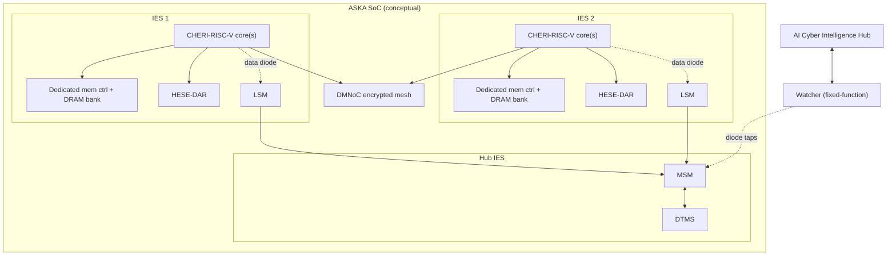
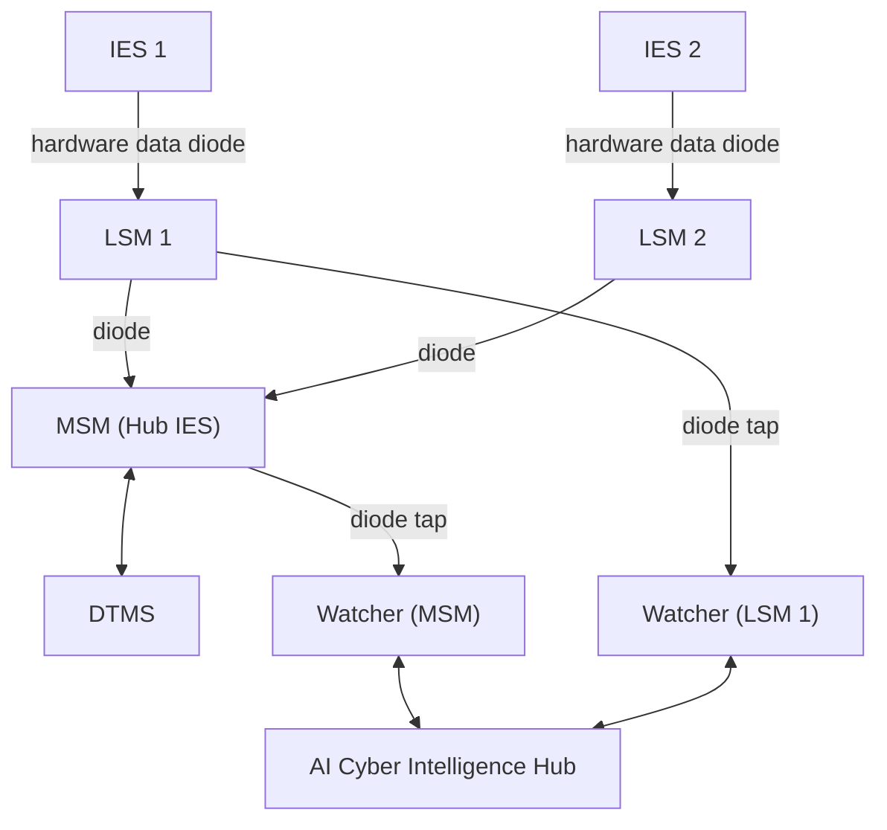
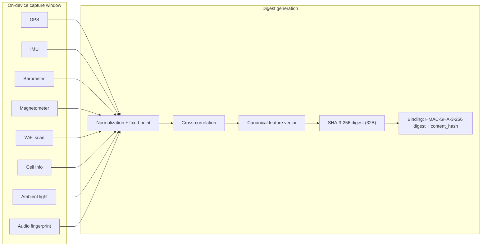

ASKA is a proposed secure compute architecture for workloads that treat cross-tenant leakage as a first-class design constraint. The core idea is simple: if two trust domains share silicon, they share leakage channels. ASKA therefore moves the trust boundary to a physical boundary (Isolated Execution Stacks) and makes every cross-boundary interaction explicit, authenticated, and time-bounded (capabilities).

**Status (2026-02-02):** Architecture + threat model + technical design docs exist; there is no FPGA prototype and no silicon.

## Why Shared-Substrate TEEs Keep Failing

The last seven years of TEE history is a repeating pattern: add a new isolation mode on a shared CPU, patch, repeat. The timeline below is the specific set of TEE compromises used throughout the ASKA design documents:

| Year | Vulnerability | CVE | Target | Impact |
|------|--------------|-----|--------|--------|
| 2018 | Foreshadow (L1TF) | CVE-2018-3615 | Intel SGX | Enclave data extraction via L1 cache side channel |
| 2018 | SGAxe | -- | Intel SGX | Attestation key extraction from SGX enclaves |
| 2019 | Plundervolt | CVE-2019-11157 | Intel SGX | Voltage fault injection corrupts SGX computations |
| 2020 | LVI (Load Value Injection) | CVE-2020-0551 | Intel SGX | Attacker-controlled data injected into SGX victim execution |
| 2020 | CrossTalk | CVE-2020-0543 | Intel SGX | Cross-core data leakage via shared staging buffer |
| 2020 | SEVered | -- | AMD SEV | Memory remapping extracts plaintext from encrypted VMs |
| 2021 | CacheOut | CVE-2020-0549 | Intel SGX | L1 data eviction from SGX enclaves |
| 2022 | AEPIC Leak | CVE-2022-21233 | Intel SGX | Architectural (not speculative) data leak via APIC MMIO |
| 2023 | CacheWarp | CVE-2023-20592 | AMD SEV-SNP | Integrity bypass via cache line manipulation |
| 2023 | Downfall (GDS) | CVE-2022-40982 | Intel SGX | Gather data sampling leaks data across SGX boundaries |
| 2024 | GoFetch | -- | Apple M-series | DMP side channel leaks cryptographic keys |
| 2024 | TDXShadow | -- | Intel TDX | Information leakage via shadow page tables |

ASKA's thesis is not "patch better". It is: **if isolation is logical but the substrate is shared, the attack surface is structural.**

## What ASKA Is (and Isn't)

ASKA is designed around four principles (with explicit costs):

1. Physical isolation over logical partitioning (3-5x silicon area).
2. Hardware policy enforcement (capability checks in switch logic).
3. Continuous trust assessment (probabilistic; requires calibration data that does not exist yet).
4. Capability-based least privilege (CHERI intra-IES, CE-PCFS inter-IES).

ASKA is also explicit about what it does *not* claim:

- It does **not** eliminate all side channels (EM and thermal coupling remain; mitigations are physical and deployment-dependent).
- It does **not** make software bugs impossible (it contains blast radius and enforces least privilege).
- It does **not** claim a fully verified SoC (only bounded properties are candidates for formal proof).

## System Architecture (Conceptual)



(Watchers and the Hub are shown as a logical relationship; the Hub may be off-chip or implemented as a high-security chiplet.)

## IES: Isolated Execution Stacks (P1)

An IES is the physical unit of isolation. Every workload runs inside an IES; every trust boundary maps to an IES boundary.

**What is physically dedicated per IES (no shared substrate between IES units):**

- Core(s) (pipeline, branch predictor, microarchitectural state)
- Cache hierarchy (private L1I/L1D; private L2)
- TLBs and page tables
- Memory controller + DRAM bank
- Voltage regulator + clock domain (independent PLL)
- I/O controller with IOMMU
- DMNoC port (sole communication path)

Typical/provisional cache sizing from the IES design draft:

| Component | Typical sizing (draft) |
|-----------|-------------------------|
| L1I / L1D | 32KB each (provisional) |
| L2 | 256KB-1MB (TBD by workload characterization) |

**Isolation cost:** 3-5x silicon area vs. shared-substrate multi-tenant designs.

### Dynamic Partitioning (P1)

A parent IES can subdivide into child IES instances at runtime:

- Minimum child size: 1 core, 64MB DRAM, 64KB L2
- Target partitioning latency: < 1ms
- Maximum nesting depth: 2-3 levels (TBD by FPGA validation)

Limitation: partitioned children share the parent IES's voltage and clock domain (and have stronger thermal coupling) so partitioning is not equivalent to separate physical IES units for side-channel resistance.

### Secure Boot + Attestation (P33)

An IES is physically gated from participating in DMNoC data traffic until it completes secure boot and DTMS attestation:

1. Hardware Root of Trust verifies Secure Boot ROM
2. Boot ROM verifies bootloader signature
3. Bootloader initializes IES hardware (DMNoC port remains disabled)
4. Mini-TRC loaded and verified via hash chain
5. DTMS attestation: report sent via DMNoC in attestation-only mode; DTMS verifies and issues operational capability
6. DMNoC port fully enabled with capability filtering (operational state)

Failure guarantee: if any step fails, the IES remains electrically isolated or limited to attestation-only traffic.

### SRBM Resource Borrowing (P9)

SRBM (Secure Resource Borrowing Mechanism) lets an idle IES lend resources to a borrower under DTMS-issued, time-bounded capabilities:

- Capability required from DTMS; enforced at the DMNoC port.
- Time-bounded lease with hardware timer; auto-revoke on expiry.
- Scrub on return: memory zeroing + cache flush before resources are released.
- Zero-copy is **not** supported across IES boundaries (no shared-memory mapping).
- Data transfer goes over DMNoC with encryption; estimated latency 5-15us per transfer depending on payload size.

Borrowable resources in the current design: DRAM capacity, compute cycles (via partitioning), partial L2 capacity (way partitioning), chiplet access. DMNoC bandwidth is not borrowed via SRBM.

### Chiplet Integration (SCI/COM) (P12)

IES units can attach hot-swappable chiplets via a Secure Chiplet Interface (SCI) mediated by a Chiplet Orchestration Module (COM):

- SCI traffic encrypted (AES-256-GCM) after mutual authentication.
- Chiplet functions are capability-gated (capabilities issued by DTMS).
- Chiplets cannot directly access IES memory; data passes through SCI with IOMMU mediation.
- COM handles discovery, authentication, firmware load (signed manifest), operation, and detach (revocation + scrub).

Planned chiplet types include: crypto accelerator, inference engine, DPI engine, and FPGA fabric.

### What We Are Not Claiming

> IES does not eliminate all side channels. EM emanation and thermal coupling are mitigated (e.g., 500um exclusion zones and shielding targets) but remain physical, measurement-dependent risks. IES also does not prevent compromise within an IES from software bugs; it prevents that compromise from automatically spreading via shared microarchitectural state.

## DMNoC: Decentralized Mesh Network-on-Chip (P2, P3, P24, P26)

DMNoC is the only path for IES-to-IES communication. It is a mesh network where routers enforce access control in hardware and links are encrypted hop-by-hop.

### Per-Link Encryption + Key Rotation

- AES-256-GCM per link (ciphertext on inter-router wires).
- Keys rotated every T seconds (default 60s) using a ratchet: `K_{n+1} = KDF(K_n, nonce)`; old keys are zeroized.

### CE-PCFS Packet Format (Draft)

The DMNoC working draft sketches a capability-enhanced packet-carried forwarding state (CE-PCFS) header:

```text
+------------------------------------------------------------------+
| Source IES ID          | 16 bits                                  |
| Destination IES ID     | 16 bits                                  |
| Packet ID              | 32 bits (replay detection)               |
| Hop Count              | 8 bits (remaining hops)                  |
| Hop Field Array        | N x HopField (one per intermediate hop)  |
| Capability Token       | 128 bits (draft placeholder; see below)  |
| Policy Field           | 16 bits (routing/security level)         |
| Header MAC             | 128 bits (AES-256-GCM tag)               |
+------------------------------------------------------------------+
| Payload (encrypted)    | Variable length                          |
+------------------------------------------------------------------+
```

HopField (stripped hop-by-hop):

```text
+------------------------------------------------------------------+
| Next Router ID         | 16 bits                                  |
| Hop Capability         | 32 bits (per-hop access constraint)      |
| Hop Policy             | 8 bits (per-hop QoS/rate constraint)     |
| Reserved               | 8 bits                                   |
+------------------------------------------------------------------+
```

**Routing mode selection (by Policy Field security level):**

- HIGH (levels 12-15): source routing (path pre-computed and auditable)
- MEDIUM (levels 4-11): source routing with limited failover
- LOW (levels 0-3): adaptive routing (XY + congestion-aware deflection)

### Capability Token Format and CCU Checking

Inter-IES access control is enforced by a Capability Checking Unit (CCU) in every router. The most detailed capability format in the design set is a candidate 256-bit token:

| Field | Bits | Purpose |
|-------|------|---------|
| Source IES ID | 8 | Original requester (audit trail) |
| Target IES ID | 8 | Current holder authorized to use it |
| Permission mask | 16 | READ/WRITE/EXECUTE/FORWARD/INVOKE/SEAL/UNSEAL (+ reserved) |
| Resource descriptor | 32 | Memory region / service endpoint / chiplet function |
| Validity start | 32 | Epoch-relative timestamp |
| Validity expiry | 32 | Epoch-relative timestamp |
| Hop constraints | 16 | Path constraint (compressed allowed-router set) |
| Sequence number | 16 | Replay detection |
| Reserved | 16 | Future use (QoS class, delegation depth, etc.) |
| Cryptographic MAC | 80 | Truncated HMAC-SHA256 or CMAC-AES-128 |

**Draft note:** the DMNoC packet header sketch above uses 16-bit IES IDs and a 128-bit "Capability Token" placeholder; the capability-system draft argues for 256 bits to carry validity + hop constraints + an 80-bit MAC. The final on-wire format is explicitly not frozen.

**CCU pipeline (pipelined; target 1 packet/cycle throughput):**

1. MAC verification (DTMS-issued token integrity)
2. Revocation structure lookup (revocation list implemented as Bloom filter / CAM / hash table; design choice)
3. Temporal validity check (expiry / start window)
4. Permission check (requested op vs. mask)
5. Resource descriptor check (range / endpoint)
6. Hop constraint check (router/path constraint)

Target latency: ~15-18 cycles total (dominated by MAC verification).

**Area / FPGA resource estimates (draft):**

- CCU logic: ~32K gates per router.
- Router implementation: ~20K-40K LUTs per router (order-of-magnitude estimate).
- 4x4 mesh (16 routers): ~320K-640K LUTs total.

### Fault Tolerance + Failure Detection

- Heartbeat-based detection for link/router failure: ~2-3 heartbeat intervals (~100ns to 1us).
- Interior routers have four neighbors (N/E/S/W), giving multiple alternate paths; rerouting is a core design requirement.

### What We Are Not Claiming

> DMNoC enforces policy on who may communicate and what resources a packet may target. It does not inspect the semantic content of messages inside an authorized channel. Bandwidth isolation guarantees depend on switch scheduling and must be validated empirically and formally. Physical probing attacks (decap, FIB, microprobing) are treated as anti-tamper and packaging problems, not something DMNoC "solves" by itself.

## DTMS: Dynamic Trust Management System (P4, P13, P15, P25)

DTMS computes trust scores, issues/revokes capabilities, and enforces policy across IES units. It runs on a dedicated Hub IES.

### Trust Model

Each IES has a continuous trust score T in [0.0, 1.0]. DTMS aggregates multiple signals:

| Signal | Weight Range | Update Frequency |
|--------|-------------|-----------------|
| Attestation status | 0.20-0.35 | Boot + periodic re-attestation |
| Behavioral history (LSM/MSM) | 0.15-0.30 | Event-driven |
| Policy violation count | 0.10-0.20 | Per-violation |
| Current security posture | 0.10-0.20 | Periodic |
| External threat intelligence | 0.05-0.10 | Asynchronous |
| Zone trust level | 0.05-0.15 | On membership change |

Special cases: attestation failure clamps trust to 0.0; without positive evidence, trust decays toward 0.0 at a configurable rate.

### Trust Root Configuration (TRC) + Mini-TRCs

Policy is rooted in a per-zone Trust Root Configuration (TRC), a signed structure containing:

- trust roots (zone authority keys; quorum required for TRC changes)
- zone_id
- membership_policy
- inter_zone_trust map (mutual / one-way / none)
- capability_rules (policy DSL)
- escalation_thresholds
- weight_config + default_trust
- schema_version

Each IES stores a mini-TRC (subset relevant to that IES) in tamper-evident storage and loads it during secure boot.

TRC modification requires distributed consensus among zone authorities (typically 2/3 quorum) and is committed to an append-only ledger.

### Policy DSL (Examples)

DTMS uses a declarative DSL stored in the TRC. Example constructs from the DTMS design draft:

```text
ALLOW source=ies.role("compute") dest=ies.role("storage")
  WHEN source.trust >= 0.6 AND dest.trust >= 0.6
  PERMISSIONS [read, write]
  EXPIRES 3600s
```

```text
RESOURCE_BORROW source=ies.id("ies-07") target=ies.id("ies-12")
  WHEN source.trust >= 0.7 AND target.trust >= 0.7
  MAX_CPU_SHARE 0.25
  MAX_MEM_SHARE 0.10
```

```text
ESCALATE target=ies.ANY
  WHEN target.anomaly_count > 5 WITHIN 60s
  ACTION set_trust(target, 0.3)
```

```text
ROUTE_AVOID path_through=ies.WHERE(trust < 0.5)
  FOR traffic_class="high_security"
```

Enforcement points are hardware: DMNoC routers, HESE-DAR controllers, and external gateways require valid capabilities.

### Zones + Inter-Zone Trust (DZMS)

Zones are administrative domains with independent TRCs. DZMS (a DTMS subsystem) handles:

- discovery via signed beacons (zone_id, TRC hash, reachability)
- membership (join/leave via consensus; mini-TRC provisioning/revocation)
- inter-zone trust negotiation (TRC exchange; bilateral trust agreement recorded on ledgers)
- inter-zone capability bridging (Zone B issues a local capability after evaluating Zone A's bridge request under the bilateral agreement)

Trust boundary note: inter-zone TRC exchange is an explicit boundary (B6) with quorum signature assumptions and residual risk if a nation-state compromises a quorum of authority keys.

### Graduated Response (TRC-Configured)

The DTMS working draft defines the following example response levels:

| Level | Example trust range | Response |
|-------|---------------------|----------|
| Level 1: Elevated Monitoring | 0.5-0.7 | Increase monitoring; narrow new capabilities; restrict SRBM |
| Level 2: Restricted Operation | 0.3-0.5 | No new capabilities; SRBM disabled; route around; shorten existing TTLs |
| Level 3: Electrical Isolation | < 0.3 | Revoke capabilities; physically disconnect IES from DMNoC |

Other drafts use different numerical cutoffs (e.g., 0.8/0.5/0.2). The architecture treats thresholds as TRC policy, not a fixed constant.

De-escalation is deliberately slower than escalation and may require re-attestation, sustained clean operation (default 1 hour in the DTMS draft), and zone authority approval for Level 3 recovery.

### What We Are Not Claiming

> DTMS does not detect attacks that perfectly mimic legitimate behavior. The effectiveness of anomaly signals depends on deployment-specific baselines and tuning data that does not exist until systems are deployed. Early deployments should expect conservative thresholds and false positives; DTMS is explicitly probabilistic.

## Capability System: CHERI (Intra-IES) + CE-PCFS (Inter-IES)

ASKA uses a two-level capability model:

- Intra-IES: CHERI-RISC-V for memory safety.
- Inter-IES: DTMS-issued capabilities carried and checked in DMNoC.

### Why CHERI-RISC-V (Not a Custom ISA)

The capability-system design rationale is pragmatic: CHERI-RISC-V provides an existing toolchain (CHERI-LLVM, CheriBSD), formal models (Sail), and years of peer review. A custom ISA is estimated at $5-10M and 3-5 years just to reach a usable toolchain.

### CHERI Capability Properties and Costs

CHERI widens pointers into capabilities with an out-of-band tag bit (unforgeability) and hardware bounds/permission checks (spatial safety). Temporal safety requires a revocation scheme (e.g., Cornucopia/CHERIvoke) and is not "free".

Empirical overhead estimates from CHERI deployments (used in ASKA planning):

- Stack: 15-25% increase
- Heap: 10-30% increase (workload-dependent)
- Tag storage: 1 bit per 128 bits of capability-bearing memory (~0.78% overhead in dedicated SRAM)

### What We Are Not Claiming

> Capabilities enforce least privilege; they do not enforce intent. A legitimate capability holder can still misuse authorized access. Distributed revocation is also not "solved"; ASKA mitigates revocation windows with short TTLs, renewal, and router-side revocation structures, but the design set contains open items (including an explicit DMNoC cryptographic open issue).

## Security Mesh: Out-of-Band Monitoring (P2, P7, P36)

ASKA monitoring is physically out-of-band. The monitored system cannot write to the monitor.



- LSM (per IES): passive taps on memory controller, performance counter mirrors, I/O, and DMNoC egress; emits anomaly scores.
- MSM (Hub): correlates cross-IES anomalies and feeds DTMS trust adjustments.
- Watchers: fixed-function invariant checkers (no CPU, no firmware updates); monitor LSM/MSM integrity and report to the Hub over an authenticated bidirectional channel.

Design trade-off: monitoring does not take direct corrective action (no in-band kill switch). Remediation flows through DTMS (capability restriction/isolation), which is slower but avoids turning monitoring into a bidirectional attack surface.

## HESE-DAR: Hardware-Encrypted Storage (P8, P14, P17)

HESE-DAR is the per-IES data-at-rest encryption and key-management boundary:

- AES-256-GCM for bulk encryption/decryption (pipelined).
- Post-quantum readiness: ML-KEM/Kyber-1024 (FIPS 203) + ML-DSA/Dilithium-5 (FIPS 204), operated in hybrid mode with classical algorithms.
- Key hierarchy: HRoT &rarr; master &rarr; per-IES &rarr; per-application; scope-limited compromise.
- Tamper sensors: voltage glitch, temperature, light (decap), active shield mesh; any trigger causes hardware key zeroization.
- Zeroization timing target: < 1 microsecond (battery-backed SRAM erase path).
- Key rotation is policy-driven (defaults in the draft: 24 hours per-application, 7 days per-IES; immediate on DTMS demand).

## Spatiotemporal Digest SDK (Near-Term Product) (P30, P31, P34b)

Spatiotemporal Digests are the first shipping deliverable in the ASKA program: a software SDK + verification API that runs on commodity phones. It is intentionally weaker than full ASKA hardware because it has no hardware root of trust for the sensor pipeline.

### What This Product Is NOT

- Not a replacement for ASKA hardware isolation.
- Not a binary "real/fake" oracle; it returns probabilistic confidence scores.
- Not a chain-of-custody system; it attests to capture conditions, not post-capture edits.
- Not robust to re-encoding or editing; the binding uses a content hash.

### Digest Generation (Capture Window -> Digest -> Binding)

The SDK captures a time-ordered sequence of sensor snapshots during the content creation window (e.g., a 10s video yields ~100 IMU readings and ~10 samples of other sensors at default rates).



Normalization details (draft): WiFi/cell lists are sorted by signal strength and top-N is retained (N=20); audio is normalized to a probability distribution (sum=1.0); fixed-point scaling is used for deterministic serialization.

Fail-open behavior: if some sensors are unavailable (e.g., no GPS indoors), the digest is still produced with a sensor mask; verification confidence will be lower.

### Verification Channels, Weights, and Verdicts

Server-side verification checks the digest against independent ground truth sources and returns per-channel scores in [0, 1] plus an aggregate confidence score:

| Channel | Example sources | Weight |
|---------|------------------|--------|
| GPS ephemeris | NASA CDDIS / IGS | 0.15 |
| Barometric pressure | NOAA ISD / national met services | 0.20 |
| WiFi signatures | Wigle.net (and other DBs where accessible) | 0.15 |
| Cellular towers | OpenCelliD / Mozilla Location Service | 0.20 |
| Geomagnetic field | NOAA IGRF/WMM models | 0.15 |
| Astronomical position | USNO / JPL Horizons | 0.15 |

Verdict thresholds:

- HIGH: aggregate >= 0.8
- MEDIUM: 0.5 <= aggregate < 0.8
- LOW: aggregate < 0.5
- FLAG: any channel scores 0.0 (contradiction overrides aggregate)

### Spoofing Costs (Economic Security Model)

Per-sensor spoofing costs from the digest design set:

| Sensor | Spoofing method | Equipment cost | Difficulty |
|--------|------------------|----------------|------------|
| GPS | SDR-based GPS simulator (HackRF + GPS-SDR-SIM) | $50-500 | Low |
| Barometric pressure | Sealed chamber with pressure controller | $1,000+ | Medium |
| WiFi signatures | Multiple WiFi APs with spoofed MACs/SSIDs | $500+ | Medium |
| Cellular signatures | Fake base stations (IMSI catchers, SDR-based) | $10,000+ | High (and illegal in many jurisdictions) |
| Magnetometer | Calibrated Helmholtz coil | $5,000+ | High |
| IMU | Firmware/sensor injection hardware or synchronized motion rig | $1,000+ to $10,000+ | High to very high |
| Audio environment | Precisely reproduced acoustic environment | $2,000+ | High |
| Ambient light | Controlled lighting matching astronomical predictions | $500+ | Medium |

A credible compound spoof (to reach HIGH confidence) is estimated at $50,000+ and requires physical proximity plus time-synchronized multi-channel spoofing.

### Environment-Dependent Confidence

Expected baseline confidence for legitimate captures varies by environment:

| Environment | Available sensors | Typical sensor count | Expected confidence | Notes |
|-------------|------------------|---------------------|--------------------|------|
| Dense urban | GPS, WiFi (many), cell (many), barometric, magnetic, light, audio | 6+ active channels, 15--30 WiFi APs, 3--8 cell towers | HIGH | Best case. |
| Suburban | GPS, WiFi (some), cell (several), barometric, magnetic, light, audio | 5--6 active channels, 5--15 WiFi APs, 2--5 cell towers | HIGH to MEDIUM | Fewer WiFi APs. |
| Rural | GPS, barometric, magnetic, cell (sparse), light, audio | 3--4 active channels, 0--3 WiFi APs, 1--2 cell towers | MEDIUM | Limited cross-checks. |
| Indoor | WiFi, cell, barometric, magnetic, light | 4--5 channels, GPS degraded or unavailable | MEDIUM to LOW | GPS loss reduces confidence. |
| Underground | Barometric (strong), magnetic (weak/distorted) | 1--2 channels | LOW | Insufficient for meaningful verification. |
| Conflict zone | Variable | Unpredictable | LOW to MEDIUM | Infrastructure damage / GPS jamming possible. |
| Maritime (open ocean) | GPS, barometric, magnetic | 3 channels, no WiFi, no cell | MEDIUM | No WiFi/cell cross-check. |
| Aerial (aircraft) | GPS, barometric, magnetic, possibly cell (brief) | 2--3 channels | MEDIUM to LOW | WiFi/cell unavailable at altitude. |

### Fundamental Limitation (Explicit)

Without a hardware root of trust, firmware-level sensor pipeline compromise is a residual risk: if the phone's sensor hub/baseband feeds fabricated readings, the SDK cannot reliably distinguish them from genuine readings. This is the strongest argument for a future hardware module / full ASKA silicon.

## Threat Model Snapshot (2026-02-02)

### Adversary Tiers (Platform)

| Tier | Budget | Physical access | Notes |
|------|--------|-----------------|------|
| 1: Remote software | < $10K | None | Commodity exploitation; contained to one IES; lateral movement blocked without capabilities |
| 2: Sophisticated remote | $10K-$1M | None | Zero-day capable; residual risk includes targeting the Hub IES software stack |
| 3: Nation-state / insider | $1M-$100M | Yes | Lab gear: FIB $500K-$2M, SEM $300K-$1M, EM probes $100K-$500K; published work shows some active shield meshes can be defeated with ~$200K equipment + weeks of labor |
| 4: Resource-unlimited | > $100M | Foundry-level | Out of scope; goal is make Tier 3 economically infeasible and Tier 4 detectable (not impossible) |

### Attack Surface Counts (By Subsystem)

From the architecture threat model (76 enumerated surfaces):

| Subsystem | Eliminated | Mitigated | Residual | Open | Total |
|-----------|-----------|-----------|----------|------|-------|
| IES | 6 | 5 | 4 | 0 | 15 |
| DMNoC | 2 | 6 | 3 | 1 | 12 |
| DTMS | 0 | 3 | 5 | 0 | 8 |
| Security Mesh | 0 | 2 | 5 | 0 | 7 |
| HESE-DAR | 1 | 2 | 5 | 0 | 8 |
| Capability System | 4 | 3 | 2 | 0 | 9 |
| Secure Boot | 0 | 5 | 2 | 0 | 7 |
| Spatiotemporal Digest | 0 | 7 | 3 | 0 | 10 |
| Total | 13 | 33 | 29 | 1 | 76 |

The single explicit "Open" item in the threat model is DMN-C1: a 32-bit truncated HMAC design decision in DMNoC cryptographic checking.

## Formal Verification Plan (Not Started)

Formal verification is planned for bounded, catastrophic-if-wrong properties; the rest is model checking and empirical testing.

| Tier | Method | Scope (examples) | Effort (draft) |
|------|--------|------------------|----------------|
| 1 | Isabelle/HOL | IES isolation (non-interference), capability correctness, HESE-DAR key confinement | 20-36 person-months total |
| 2 | NuSMV / SPIN / ProVerif | DMNoC routing, secure boot, bounded revocation propagation | 8-14 person-months |
| 3 | FPGA + measurement | side channels (EM/thermal), anomaly detection accuracy, tamper sensors | empirical |

**Hard rule:** ASIC tape-out proceeds only after Tier 1 abstract proofs for IES isolation and capability system correctness are complete and peer-reviewed.

## Current Status

As of 2026-02-02:

| Milestone | Status |
|----------|--------|
| Architecture specification | Complete (200+ pages) |
| Patent portfolio | 34+ patents with ~350 claims |
| Threat model | Working draft (76 attack surfaces; includes explicit residuals and an open item) |
| Technical design documents | Working drafts (subsystem-level specs) |
| Interface specifications | Working draft (inter-subsystem contracts) |
| Spatiotemporal Digest SDK | Functional prototype (Android); iOS constrained by entitlements |
| FPGA prototype | Not started |
| ASIC design | Not started |
| Team | Solo architect (see resourcing plan in source docs) |

## Roadmap (High Level)

Phases are gated; if platform-risk milestones fail, the digest track can proceed independently.

| Phase | Timeline | Digest track | Platform track |
|-------|----------|-------------|----------------|
| 0 | Months 0-6 | SDK alpha (minimum 3 sensor types) | 2-IES FPGA PoC; core hires |
| 1 | Months 6-18 | SDK 1.0 + verification API | 16-IES FPGA; DMNoC implementation; Tier 1 proofs (abstract) |
| 2 | Months 18-36 | SDK 2.0 + hardware-module support | ASIC design start; full integration |
| 3 | Months 36-48 | Hardware at scale | First silicon; certification engagement |

## Resources

- **GitHub:** [github.com/nshkrdotcom/ASKA](https://github.com/nshkrdotcom/ASKA)
- **ChronoLedger** (related project): [ChronoLedger on NSHkr.com](/chronoledger/)
- **Technical documentation for AI agents:** [/for-agents/](/for-agents/)
