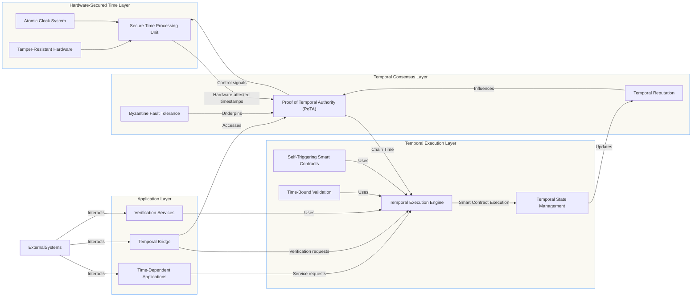

<style>
    a {
    color: #3489F0;        
    }
  /* Optional: Add specific styles for this page if needed */
  .feature-icon {
    font-size: 2em; /* Example */
    margin-bottom: 10px;
  }
  .use-case-box {
    border: 1px solid #eee; /* Consider using var(--border-color) */
    padding: 15px;
    margin-bottom: 15px;
    border-radius: 5px;
    background-color: rgba(15, 21, 32, 0.5); /* Slightly lighter background for boxes */
  }
  /* Ensure mermaid diagrams render correctly */
   .mermaid {
    background-color: var(--bg-secondary); /* Match pre background */
    border: 1px solid var(--border-color);
    border-radius: 8px;
    padding: var(--space-4);
    margin: var(--space-4) 0;
  }
</style>

*Paul E Lowndes*  
*ZeroTrust@NSHkr.com*  
*March 5, 2025*

## Abstract

This whitepaper introduces the Temporal Blockchain, a novel distributed ledger technology that integrates hardware-secured timekeeping directly into its consensus mechanism. Unlike traditional blockchain systems that treat time as an external parameter subject to manipulation, the Temporal Blockchain elevates time to a first-class structural element through specialized Temporal Mining Nodes (TMNs) equipped with chip-scale atomic clocks and tamper-resistant hardware security modules. This innovation enables a new consensus protocol—Proof of Temporal Authority (PoTA)—that achieves Byzantine fault tolerance while preserving strong temporal guarantees. The system supports native time-based capabilities including self-triggering smart contracts, secure offline operation, and cross-chain temporal verification. These advancements address critical limitations in existing blockchain architectures, enabling new classes of applications that depend on trustless temporal awareness, such as time-locked financial instruments, deadline-enforcing governance systems, and secure timestamp verification for digital evidence. This paper presents the theoretical foundations, system architecture, security analysis, and implementation considerations for the Temporal Blockchain.

## Table of Contents

1.  [Introduction](#1-introduction)
    *   [1.1 The Problem of Time in Distributed Systems](#11-the-problem-of-time-in-distributed-systems)
    *   [1.2 Existing Approaches and Their Limitations](#12-existing-approaches-and-their-limitations)
    *   [1.3 Our Contribution](#13-our-contribution)
2.  [System Architecture](#2-system-architecture)
    *   [2.1 Core System Layers](#21-core-system-layers)
    *   [2.2 System Interactions](#22-system-interactions)
    *   [2.3 Data Flow Architecture](#23-data-flow-architecture)
3.  [Temporal Mining Nodes](#3-temporal-mining-nodes)
    *   [3.1 Hardware Architecture](#31-hardware-architecture)
    *   [3.2 Physical Security Measures](#32-physical-security-measures)
    *   [3.3 Temporal Attestation Process](#33-temporal-attestation-process)
    *   [3.4 Implementation Variants](#34-implementation-variants)
4.  [Proof of Temporal Authority Consensus](#4-proof-of-temporal-authority-consensus)
    *   [4.1 Consensus Overview](#41-consensus-overview)
    *   [4.2 Block Proposal Process](#42-block-proposal-process)
    *   [4.3 Block Validation Process](#43-block-validation-process)
    *   [4.4 Temporal Reputation System](#44-temporal-reputation-system)
    *   [4.5 Slashing Mechanisms](#45-slashing-mechanisms)
5.  [Temporal Execution Engine](#5-temporal-execution-engine)
    *   [5.1 Overview](#51-overview)
    *   [5.2 New Temporal Opcodes](#52-new-temporal-opcodes)
    *   [5.3 Self-Triggering Smart Contracts](#53-self-triggering-smart-contracts)
    *   [5.4 Temporal State Management](#54-temporal-state-management)
    *   [5.5 Security Considerations](#55-security-considerations)
6.  [Secure Offline Operation](#6-secure-offline-operation)
    *   [6.1 Overview](#61-overview)
    *   [6.2 Pre-Shared Initialization Vectors](#62-pre-shared-initialization-vectors)
    *   [6.3 Drift Compensation](#63-drift-compensation)
    *   [6.4 Offline Timestamp Generation](#64-offline-timestamp-generation)
    *   [6.5 Offline Timestamp Verification](#65-offline-timestamp-verification)
    *   [6.6 Limited Transaction Processing](#66-limited-transaction-processing)
    *   [6.7 Secure Re-synchronization](#67-secure-re-synchronization)
7.  [Temporal Bridge](#7-temporal-bridge)
    *   [7.1 Overview](#71-overview)
    *   [7.2 Cross-Chain Communication Protocols](#72-cross-chain-communication-protocols)
    *   [7.3 Timestamp Anchoring Mechanism](#73-timestamp-anchoring-mechanism)
    *   [7.4 Temporal Proof Verification](#74-temporal-proof-verification)
    *   [7.5 Security Considerations](#75-security-considerations)
8.  [Security Analysis](#8-security-analysis)
    *   [8.1 Threat Model](#81-threat-model)
    *   [8.2 Time Manipulation Attacks](#82-time-manipulation-attacks)
    *   [8.3 Sybil Attacks](#83-sybil-attacks)
    *   [8.4 Byzantine Fault Tolerance](#84-byzantine-fault-tolerance)
    *   [8.5 Long-Range Attacks](#85-long-range-attacks)
    *   [8.6 Eclipse Attacks](#86-eclipse-attacks)
    *   [8.7 Hardware-Level Attacks](#87-hardware-level-attacks)
    *   [8.8 Quantum Resistance](#88-quantum-resistance)
9.  [Mathematical Foundations](#9-mathematical-foundations)
    *   [9.1 Temporal Distributed Trust Architecture](#91-temporal-distributed-trust-architecture)
    *   [9.2 Temporal Asymmetric Resistance](#92-temporal-asymmetric-resistance)
    *   [9.3 Time-Manipulation Resistance](#93-time-manipulation-resistance)
    *   [9.4 Long-term Time Security](#94-long-term-time-security)
    *   [9.5 Offline Security Guarantee](#95-offline-security-guarantee)
10. [Implementation Considerations](#10-implementation-considerations)
    *   [10.1 Hardware Production and Distribution](#101-hardware-production-and-distribution)
    *   [10.2 Network Bootstrapping](#102-network-bootstrapping)
    *   [10.3 Scalability](#103-scalability)
    *   [10.4 Governance](#104-governance)
    *   [10.5 Regulatory Considerations](#105-regulatory-considerations)
11. [Use Cases](#11-use-cases)
    *   [11.1 Financial Applications](#111-financial-applications)
    *   [11.2 Supply Chain and Logistics](#112-supply-chain-and-logistics)
    *   [11.3 Digital Evidence and Compliance](#113-digital-evidence-and-compliance)
    *   [11.4 Decentralized Governance](#114-decentralized-governance)
    *   [11.5 Time-Sensitive IoT Applications](#115-time-sensitive-iot-applications)
12. [Comparisons to Existing Technologies](#12-comparisons-to-existing-technologies)
    *   [12.1 Traditional Blockchain Timestamps](#121-traditional-blockchain-timestamps)
    *   [12.2 External Oracle Solutions](#122-external-oracle-solutions)
    *   [12.3 Proof of History (Solana)](#123-proof-of-history-solana)
    *   [12.4 Trusted Hardware Solutions](#124-trusted-hardware-solutions)
    *   [12.5 Trusted Timestamp Authorities](#125-trusted-timestamp-authorities)
13. [Future Research Directions](#13-future-research-directions)
    *   [13.1 Advanced Hardware Integration](#131-advanced-hardware-integration)
    *   [13.2 Consensus Enhancements](#132-consensus-enhancements)
    *   [13.3 Cross-Chain Temporal Coordination](#133-cross-chain-temporal-coordination)
    *   [13.4 Advanced Applications](#134-advanced-applications)
14. [Conclusion](#14-conclusion)
15. [References](#15-references)

---

## 1. Introduction

### 1.1 The Problem of Time in Distributed Systems

Time synchronization remains one of the most challenging problems in distributed systems. While traditional blockchains have revolutionized trust in distributed computing, they have largely sidestepped the challenge of trustless temporal awareness. Most blockchain systems rely on block timestamps that are:

*   Subjectively determined by miners or validators
*   Not cryptographically verifiable as accurate
*   Vulnerable to manipulation within certain bounds
*   Not precise enough for many time-sensitive applications

These limitations create a trust gap in time-dependent applications, forcing them to rely on centralized time oracles or accept weakened time guarantees. This gap significantly restricts the application domain of blockchain technology and introduces vulnerabilities in systems where accurate time is critical.

### 1.2 Existing Approaches and Their Limitations

Current approaches to handling time in blockchain systems include:

*   **Block Timestamps:** Determined by block proposers, typically only required to be greater than the previous block's timestamp, often manipulable within several minutes, and lack cryptographic attestation of accuracy.
*   **External Oracles:** Introduce centralization and trust assumptions, create single points of failure, increase operational complexity, and often lack hardware security guarantees.
*   **Verifiable Delay Functions (VDFs):** Provide relative ordering rather than absolute time, cannot prove that a specific wall-clock time has occurred, and require trust in the VDF setup and parameters.

These approaches fail to provide the robust temporal foundation required for truly trustless time-dependent applications.

### 1.3 Our Contribution

The Temporal Blockchain represents a fundamental paradigm shift by solving the critical problem of trustless temporal awareness. By integrating hardware-secured timekeeping directly into the consensus mechanism, it transforms time from an external parameter into a first-class structural element within blockchain architecture.

Key innovations include:

1.  **Hardware-Secured Time Layer:** Specialized Temporal Mining Nodes with multi-layered hardware clock systems and secure time processing units.
2.  **Proof of Temporal Authority:** A novel consensus mechanism that weaves temporal accuracy into the fabric of network trust.
3.  **Self-Triggering Smart Contracts:** Native temporal execution capabilities that eliminate the need for external triggers.
4.  **Secure Offline Operation:** Continued operation with verifiable timestamps even when disconnected from the network.
5.  **Cross-Chain Temporal Verification:** Bridge protocols enabling other blockchains to leverage the Temporal Blockchain's time guarantees.

These innovations collectively enable a new generation of time-dependent blockchain applications with unprecedented security, accuracy, and trust characteristics.

## 2. System Architecture

The Temporal Blockchain system comprises four primary architectural layers, each designed to support trustless temporal awareness throughout the blockchain.

### 2.1 Core System Layers

1.  **Hardware-Secured Time Layer:** The physical source of trusted time, comprising the specialized hardware within each Temporal Mining Node (TMN) - multi-layered clocks, Secure Time Processing Unit (STPU), HSM, PUF, tamper-resistant enclosure, and environmental sensors.
2.  **Temporal Consensus Layer:** Implements the Proof of Temporal Authority (PoTA) consensus mechanism, responsible for block proposal, timestamp validation, Byzantine fault-tolerant voting, temporal reputation management, slashing, and network-wide time synchronization.
3.  **Temporal Execution Layer:** Provides the smart contract execution environment (Temporal Execution Engine - TEE), enhanced with native temporal capabilities like self-triggering contracts and temporal state management.
4.  **Application Layer:** Provides interfaces (APIs, SDKs) for users and developers, includes the Temporal Bridge for interoperability, and offers verification services for temporal proofs.

### 2.2 System Interactions

Temporal information flows from the Hardware-Secured Time Layer upwards. Attested timestamps feed into the Consensus Layer, which establishes "Chain Time." The Execution Layer uses Chain Time to trigger smart contracts. The Application Layer builds upon these temporal guarantees.

### 2.3 Data Flow Architecture



*[Diagram Description: A layered architecture diagram showing the four core layers (Hardware, Consensus, Execution, Application) and the flow of information (hardware timestamps, control signals, chain time, service requests) between them.]*

## 3. Temporal Mining Nodes

Temporal Mining Nodes (TMNs) are the specialized hardware pillars of the Temporal Blockchain, ensuring the integrity and accuracy of the system's intrinsic time.

### 3.1 Hardware Architecture

Each TMN features a robust, multi-layered hardware design:

*   **Multi-Layered Hardware Clock System:**
    *   Primary: Chip-Scale Atomic Clock (CSAC) (Cesium/Rubidium, Stability ≤ 1×10⁻¹² /day).
    *   Secondary: Temperature-Compensated Crystal Oscillator (TCXO) (SC-cut, Ovenized preferred, Stability ≤ 5×10⁻⁸).
    *   Secured GNSS Receiver (Optional but Recommended): Multi-constellation, Anti-spoofing/jamming, Signed Firmware.
    *   Multipath Temporal Validation Unit (MTVU): Hardware unit performing cross-validation, outlier detection, weighted averaging, and drift compensation (Kalman filtering).
*   **Secure Time Processing Unit (STPU):**
    *   Custom silicon (ASIC/Secure MCU) with secure execution environment.
    *   Handles clock management, time anomaly detection, side-channel resistance, fault injection detection, runtime integrity monitoring.
    *   Performs cryptographic attestation generation/verification.
*   **Hardware Security Module (HSM):**
    *   FIPS 140-3 Level 4 (or equivalent) certified.
    *   Secure key storage (private keys never leave boundary).
    *   Performs time-sensitive crypto operations (including Post-Quantum algorithms).
    *   Physically secured with active mesh, environmental sensors, key zeroization.
*   **Physical Unclonable Function (PUF):**
    *   Silicon-based challenge-response type.
    *   Provides unique, unclonable hardware identity for authentication and key derivation.
    *   Tamper-evident.

*[Diagram Placeholder: Figure 2 - TMN Hardware Architecture]*

### 3.2 Physical Security Measures

TMNs are housed within tamper-resistant enclosures featuring:

*   Multi-layer composite construction with conductive mesh.
*   IP67 environmental protection.
*   Volumetric, breach, light, pressure, temperature, and motion sensors.
*   Automated key zeroization and secure audit logging upon tamper detection.

### 3.3 Temporal Attestation Process

1.  **Acquisition:** STPU reads time from CSAC, TCXO, GNSS.
2.  **Validation (MTVU):** Cross-validation, outlier removal, weighted averaging based on source quality/stability.
3.  **Compensation:** Kalman filter applied to correct for drift.
4.  **Attestation:** STPU creates a timestamp structure including the validated time, confidence interval, node ID (from PUF), metadata, and offline status.
5.  **Signing:** STPU uses the HSM to sign the attestation with the TMN's private key.

### 3.4 Implementation Variants

*   **Enterprise Edition:** Rack-mounted, full features, redundant power/networking.
*   **Standard Edition:** Desktop form factor, core features, battery backup.
*   **Embedded Edition:** Miniaturized, essential security, for IoT/embedded use.

## 4. Proof of Temporal Authority Consensus

Proof of Temporal Authority (PoTA) is a novel consensus mechanism designed specifically for the Temporal Blockchain, prioritizing verifiable temporal accuracy.

*[Diagram Placeholder: Figure 3 - PoTA Consensus Flowchart]*

### 4.1 Consensus Overview

PoTA achieves Byzantine fault tolerance (BFT) by integrating hardware-secured time into the consensus process. Its core principles are:

*   **Hardware-Rooted Time:** Timestamp accuracy is the primary measure of trust.
*   **Temporal Reputation:** Nodes build reputation based on historical accuracy.
*   **Weighted Voting:** Voting power is primarily determined by temporal reputation.
*   **Dynamic Parameters:** Tolerance windows and other parameters adapt to network conditions.
*   **Slashing:** Penalties enforce accurate timekeeping.

### 4.2 Block Proposal Process

1.  **Eligibility:** Nodes with reputation above a threshold are eligible. Stake (optional) and VRF weighted by reputation determine the proposer for each slot.
2.  **Timestamping:** Proposer generates a hardware-attested timestamp via STPU.
3.  **Construction:** Block includes timestamp, previous hash, transactions, proposer ID, reputation, signature, VRF proof.
4.  **Broadcast:** Block is sent to the network.

### 4.3 Block Validation Process

Receiving nodes perform rigorous checks:

1.  **Signature & Eligibility:** Verify proposer signature and VRF proof.
2.  **Timestamp Attestation:** Verify cryptographic signature on the timestamp.
3.  **Timestamp Accuracy:** Compare timestamp to local hardware clock within a *dynamic tolerance window* (adjusts based on latency, drift).
4.  **Temporal Consistency:** Check monotonicity (timestamp > previous block's) and absence of anomalous jumps.
5.  **Transaction Validity:** Verify all included transactions.

### 4.4 Temporal Reputation System

Reputation ($R$) incentivizes accuracy:

$$R(a, t+1) = R(a, t) + \beta \cdot (Accuracy(a, t) - R(a, t)) - \gamma \cdot Penalty(a, t)$$

*   $Accuracy(a, t) = 1 - \frac{|T_{node}(a, t) - T_{consensus}(t)|}{ToleranceWindow(t)}$
*   $\beta$ (learning rate) and $\gamma$ (penalty coefficient) control sensitivity.
*   Scores are bounded (e.g., 0-1). Optional decay prevents stagnation.

### 4.5 Slashing Mechanisms

Penalties for malicious behavior (inaccurate timestamps, double voting, censorship, equivocation):

*   Significant reputation reduction.
*   Stake confiscation (if applicable).
*   Temporary or permanent exclusion from consensus.

## 5. Temporal Execution Engine

The Temporal Execution Engine (TEE) extends a standard blockchain VM (e.g., EVM-compatible) with native temporal capabilities.

*[Diagram Placeholder: Figure 4 - TEE Architecture]*

### 5.1 Overview

The TEE enables smart contracts to:

*   Securely access the hardware-verified consensus time.
*   Schedule future function calls autonomously.
*   Execute logic based on precise temporal conditions.

### 5.2 New Temporal Opcodes

*   **`TIMESTAMP_NOW` (0x40):** Returns current consensus time (nanoseconds since epoch). *Trustless and hardware-verified*.
*   **`SCHEDULE_CALL` (0x41):** Schedules a function call (`target_address`, `data`) for execution at a specific future `timestamp`. Returns a unique `call_id`. Guarantees eventual, ordered, atomic execution.
*   **`AFTER` (0x42) / `BEFORE` (0x43):** Boolean conditionals checking if `TIMESTAMP_NOW` is after/before a given `timestamp`.
*   **`CANCEL_SCHEDULE_CALL` (0x44) (Optional):** Cancels a pending scheduled call using its `call_id` (requires authorization).
*   **`CHECK_SCHEDULED_CALL` (0x45) (Optional):** Queries the status (Pending, Executed, etc.) of a scheduled call.

### 5.3 Self-Triggering Smart Contracts

These opcodes enable contracts to execute logic autonomously based on time, without external intervention. Example:

```solidity
// Simplified Temporal Escrow
contract TemporalEscrow {
    address payable public seller;
    uint256 public releaseTime; // Hardware-verified time

    constructor(address payable _seller, uint256 _lockDuration) payable {
        seller = _seller;
        releaseTime = TIMESTAMP_NOW + _lockDuration; // Use hardware time
        // Schedule the release function call
        SCHEDULE_CALL(gas, address(this), 0, abi.encodeWithSignature("release()"), releaseTime);
    }

    function release() public {
        require(msg.sender == address(this), "Only self-callable"); // Security check
        require(TIMESTAMP_NOW >= releaseTime, "Too early");
        seller.transfer(address(this).balance);
    }
     // Need receive() to accept Ether
    receive() external payable {}
}
```

### 5.4 Temporal State Management

*   **Scheduling Queue:** A persistent, ordered priority queue (part of the blockchain state) stores pending `SCHEDULE_CALL` requests.
*   **Execution:** The TEE processes the queue each block, executing calls whose time has arrived.
*   **State Root:** The queue's state is included in the block's state Merkle root.

### 5.5 Security Considerations

*   Gas costs for temporal opcodes are carefully calibrated.
*   Reentrancy protection applies to scheduled calls.
*   Rate limiting prevents scheduling queue DoS attacks.
*   Time bounds validation prevents scheduling far past/future calls.
*   Developers must use `TIMESTAMP_NOW` for security-critical logic, not less reliable sources.

## 6. Secure Offline Operation

TMNs can operate securely offline, generating verifiable timestamps without network connectivity.

*[Diagram Placeholder: Figure 5 - Secure Offline Operation Flowchart]*

### 6.1 Overview

Leverages the TMN's internal atomic clock, drift compensation, and pre-shared cryptographic material (Initialization Vectors - IVs). Allows limited, pre-approved transaction processing.

### 6.2 Pre-Shared Initialization Vectors

*   **Structure:** `timestamp` (network consensus time), `random_value`, `hmac` (signed by quorum of online TMNs), `expiration_time`, `node_id`.
*   **Generation:** Requested by TMN before going offline, generated and signed by online quorum. Stored securely in HSM.
*   **Security:** Unforgeable (HMAC), unique (random value), time-bound, node-specific.

### 6.3 Drift Compensation

*   **Algorithm:** Kalman filtering using prior measurements, environmental sensor data (temperature), and known clock characteristics.
*   **Execution:** Runs continuously on the STPU while offline.
*   **Accuracy:** Maintains high accuracy over extended periods (e.g., < 100 μs drift over 30 days).

### 6.4 Offline Timestamp Generation

1.  Read time from CSAC.
2.  Apply drift correction via Kalman filter.
3.  Select next unused IV.
4.  Create timestamp structure (corrected time, IV index, offline status, drift data).
5.  Sign using HSM, incorporating IV.

### 6.5 Offline Timestamp Verification

Performed upon reconnection:

1.  Retrieve corresponding IV.
2.  Verify IV's HMAC.
3.  Verify timestamp signature.
4.  Check timestamp against expected drift range.
5.  Ensure IV hasn't been used before (liveness check).

### 6.6 Limited Transaction Processing

*   **Allowed:** Dead man's switch activation, pre-signed transactions, time-stamped attestations (non-value), emergency messages.
*   **Prohibited:** Standard value transfers, most smart contract state changes (to prevent double-spending).
*   **Storage:** Transactions stored securely in HSM until reconnection.

### 6.7 Secure Re-synchronization

Upon reconnection:

1.  Synchronize clock with network consensus time.
2.  Obtain new IV set.
3.  Submit offline transactions/timestamps for network validation.
4.  Update local blockchain state.
5.  Reputation may be temporarily adjusted based on offline duration/accuracy.

## 7. Temporal Bridge

Enables interoperability, allowing external blockchains to verify and utilize the Temporal Blockchain's time.

*[Diagram Placeholder: Figure 6 - Temporal Bridge Architecture]*

### 7.1 Overview

Acts as a decentralized, trust-minimized intermediary. External chains can verify temporal proofs and access consensus time.

### 7.2 Cross-Chain Communication Protocols

Supports various methods:

*   **Light Clients:** External chain runs a light client (e.g., BTC Relay style, ETH2 Light Client, Cosmos IBC).
*   **Relay Networks:** Independent relayers (e.g., Chainlink, custom network with staking/slashing) transfer data.
*   **Direct Communication:** Uses native protocols where available (e.g., Polkadot parachain, Cosmos IBC).

### 7.3 Timestamp Anchoring Mechanism

Periodically records Temporal Blockchain state onto external chains:

*   **Anchor Data:** `block_height`, `block_hash`, `timestamp`, `merkle_root` (state), quorum `signatures` (aggregated, e.g., BLS).
*   **Process:** Select anchor block -> Collect data -> Aggregate signatures -> Submit to external chain via chosen protocol -> External chain verifies signatures.
*   **Frequency:** Configurable trade-off between latency and cost.

### 7.4 Temporal Proof Verification

External chains verify timestamps using proofs:

*   **Proof Structure:** `timestamp`, `block_hash`, `merkle_proof` (timestamp inclusion in block), `anchor_proof` (block inclusion in anchor), `attestation_signature`.
*   **Process:** Verify anchor proof -> Verify Merkle proof -> Verify signature.

### 7.5 Security Considerations

Relies on Temporal Blockchain security, chosen communication protocol security, relayer incentives (if used), light client assumptions (if used), and secure smart contracts on the external chain.

## 8. Security Analysis

Addresses various threats through its multi-layered design.

*[Diagram Placeholder: Figure 7 - Secure Boot Process Flowchart]*

### 8.1 Threat Model

Assumes a powerful adversary capable of network control, high computation (but not breaking crypto assumptions), compromising some nodes, and physical access to some TMNs.

### 8.2 Time Manipulation Attacks

Mitigated by hardware security (CSAC, STPU, HSM), PoTA consensus (reputation, BFT voting), multi-source validation, drift compensation, anomaly detection, and secured GNSS.

### 8.3 Sybil Attacks

Mitigated by hardware requirements (TMNs are expensive/difficult to fake), PUFs (unclonable identity), temporal reputation (new nodes have low influence), and optional staking.

### 8.4 Byzantine Fault Tolerance

PoTA ensures safety ($W_{faulty} < \frac{1}{3} W_{total}$) and liveness. Reputation weighting further minimizes impact of compromised nodes.

### 8.5 Long-Range Attacks

Mitigated by checkpointing, stake-based finality (optional), and temporal anchoring to external chains. Hardware time prevents easy forging of past blocks.

### 8.6 Eclipse Attacks

Mitigated by robust P2P networking (multiple connections, gossip), optional out-of-band verification, and secure offline operation capability.

### 8.7 Hardware-Level Attacks

Mitigated by tamper-resistant enclosures, environmental sensors, STPU/HSM security features (side-channel resistance, fault detection), PUFs, secure boot, and key zeroization upon tamper detection.

### 8.8 Quantum Resistance

Employs post-quantum algorithms (CRYSTALS-Dilithium, Kyber, Falcon, SPHINCS+, SHA-3) for signatures, key exchange, and hashing, ensuring long-term security.

*[Diagram Placeholder: Figure 8 - Temporal Federation Diagram]*
*[Diagram Placeholder: Figure 9 - Multipath Temporal Validation Process Flowchart]*
*[Diagram Placeholder: Figure 10 - State Transition Diagram]*

## 9. Mathematical Foundations

Provides the formal basis for the system's operations.

*   **Temporal Reputation:** Equation (1) updates reputation based on accuracy and penalties. Equation (2) calculates accuracy relative to the consensus time and tolerance window.
*   **Vote Weighting:** Equation for $W(a)$ combines reputation $R(a,t)$ and optional stake $S(a,t)$ using coefficient $\alpha$.
*   **BFT Condition:** $W_{faulty} < \frac{1}{3} W_{total}$.
*   **Time-Manipulation Resistance:** Equation (9) models resistance based on network diversity and cost.
*   **Long-Term Security:** Equation (10) models security decay vs. network growth.
*   **Offline Security:** Equation (11) models security degradation based on offline duration and drift.
*   **Dynamic Tolerance Window:** Equation (12) models adaptive adjustment based on network conditions.
*   **Multipath Weighting:** Equation (13) models how different time source readings are combined.
*   *(See patent document for full formulas corresponding to Temporal Commitments, Entropy, Knowledge Cascades, ITRA, and Trust Transitivity if those framework components are included.)*

## 10. Implementation Considerations

Addresses practical aspects of building and operating the network.

*   **Hardware:** Sourcing, secure manufacturing, quality control, distribution, cost optimization.
*   **Network Bootstrapping:** Genesis block creation (anchored to external, high-precision sources including quantum clocks), founding nodes, calibration period, secure node onboarding.
*   **Scalability:** Communication complexity (gossip), reputation tracking, block propagation, transaction throughput (parallel execution, queue management), potential sharding.
*   **Governance:** On-chain voting, DAOs, or multi-sig for parameter adjustments (tolerance window, reputation factors, slashing rules) and protocol upgrades (backward compatibility, hardware coordination).
*   **Regulatory:** Export controls (atomic clocks, crypto hardware), compliance features (audit trails, monitoring).
*   **Temporal State Compression:** Techniques like Merkle Trees, snapshots, accumulators, state expiry, and ZKPs to manage long-term data growth efficiently.
*   **Multi-Temporal Consensus:** Potential for nested timescales for scalability and varied application needs.
*   **Software Development Tools:** SDKs, language extensions (Solidity), simulators, debuggers, formal verification tools.
*   **Network Monitoring:** Real-time tracking of connectivity, consensus participation, temporal accuracy, reputation, hardware health, scheduling queue, security events, and performance metrics.

## 11. Use Cases

Highlights applications uniquely enabled by verifiable, hardware-secured time.

*   **Finance:** Precise settlement, time-locked instruments, HFT timestamping, DeFi derivatives, regulatory compliance (MiFID II).
*   **Supply Chain:** Verifiable PoD/custody, cold chain integrity, SLA enforcement.
*   **Legal/Compliance:** Digital evidence timestamping, secure archival, notarization.
*   **Governance:** Time-bound voting, scheduled upgrades, dead man's switches.
*   **IoT/Industrial:** Secure device sync, critical infrastructure timing, temporal access control.
*   **Gaming/Metaverse:** Fair event timing, verifiable randomness, time-locked assets.
*   **Science:** Verifiable experiment timestamps, data integrity.

## 12. Comparisons to Existing Technologies

Demonstrates superiority over:

*   **Traditional Block Timestamps:** Inaccurate, manipulable, lack verification.
*   **External Oracles:** Centralized, require trust, vulnerable, add latency.
*   **Proof of History (Solana):** Relative ordering only, no absolute time, VDF trust assumptions.
*   **Trusted Hardware (TEE/SGX):** Centralized vendor trust, side-channel vulnerable, limited temporal features.
*   **Trusted Timestamp Authorities:** Centralized, require trust, external integration, basic functionality.

## 13. Future Research Directions

*   **Hardware:** Further miniaturization/cost reduction of atomic clocks, novel tamper resistance, quantum time sources, specialized ASICs.
*   **Consensus:** Hybrid mechanisms, temporal sharding, hierarchical consensus, advanced reputation algorithms, formal verification.
*   **Interoperability:** Unified time standards, cross-chain temporal proofs (zk-proofs), optimized bridges.
*   **Applications:** Temporal ZK systems, quantum-temporal integration, advanced chrono-economic models.

## 14. Conclusion

The Temporal Blockchain fundamentally solves the problem of trustless time in distributed systems by integrating hardware-secured timekeeping into its core consensus and execution layers. Through TMNs, PoTA, and the TEE, it provides unparalleled accuracy, security, and functionality for time-sensitive applications. It moves beyond existing limitations, enabling a new generation of decentralized systems where time is a verifiable, first-class element, underpinning trust and resilience across finance, governance, logistics, and beyond.

## 15. References

(Includes standard blockchain papers, time protocol RFCs, hardware papers like CSAC specs, security papers on side-channels/fault attacks, quantum crypto standards, etc. - See patent document for full list)

1.  Nakamoto, S. (2008). "Bitcoin: A Peer-to-Peer Electronic Cash System."
2.  Buterin, V. (2014). "Ethereum: A Next-Generation Smart Contract and Decentralized Application Platform."
3.  Castro, M., & Liskov, B. (1999). "Practical Byzantine Fault Tolerance." *OSDI*.
4.  Yakovenko, A. (2018). "Solana: A new architecture for a high performance blockchain."
5.  Fischer, M. J., et al. (1985). "Impossibility of Distributed Consensus with One Faulty Process." *JACM*.
6.  Douceur, J. R. (2002). "The Sybil Attack." *IPTPS*.
7.  Haber, S., & Stornetta, W. S. (1991). "How to Time-Stamp a Digital Document." *CRYPTO*.
8.  Adams, C., et al. (2001). "Internet X.509 Public Key Infrastructure Time-Stamp Protocol (TSP)." RFC 3161.
9.  Costan, V., & Devadas, S. (2016). "Intel SGX Explained." *IACR ePrint*.
10. Kocher, P., et al. (2019). "Spectre Attacks: Exploiting Speculative Execution." *IEEE S&P*.
11. Bar-El, H., et al. (2006). "The Sorcerer's Apprentice Guide to Fault Attacks." *Proc. IEEE*.
12. Suhail, S., et al. (2020). "On the Role of Hash-Based Signatures in Quantum-Safe Internet of Things." *IEEE IoT Journal*.
13. Kwon, J., & Buchman, E. (2016). "Cosmos: A Network of Distributed Ledgers."
14. Garay, J., et al. (2015). "The Bitcoin Backbone Protocol: Analysis and Applications." *EUROCRYPT*.
15. Papamanthou, C., et al. (2011). "Optimal Verification of Operations on Dynamic Sets." *CRYPTO*.
16. Boneh, D., et al. (2018). "Verifiable Delay Functions." *CRYPTO*.
17. Lowe, G. (1996). "Breaking and fixing the Needham-Schroeder public-key protocol using FDR." *TACAS*.
18. Lamport, L. (1978). "Time, clocks, and the ordering of events in a distributed system." *CACM*.
19. *(TODO: Include CSAC/Hardware Specs as cited in Patent Doc)*
20. *(TODO: Include CSAC/Hardware Specs as cited in Patent Doc)*
21. *(TODO: Include CSAC/Hardware Specs as cited in Patent Doc)*
22. *(TODO: Include CSAC/Hardware Specs as cited in Patent Doc)*
23. *(TODO: Include Clock/Timing Specs as cited in Patent Doc)*
24. *(TODO: Include Clock/Timing Specs as cited in Patent Doc)*
25. *(TODO: Include Clock/Timing Specs as cited in Patent Doc)*
26. *(TODO: Include Oracle Docs/Papers as cited in Patent Doc)*

<a href="/chronoledger/">Back to ChronoLedger</a>