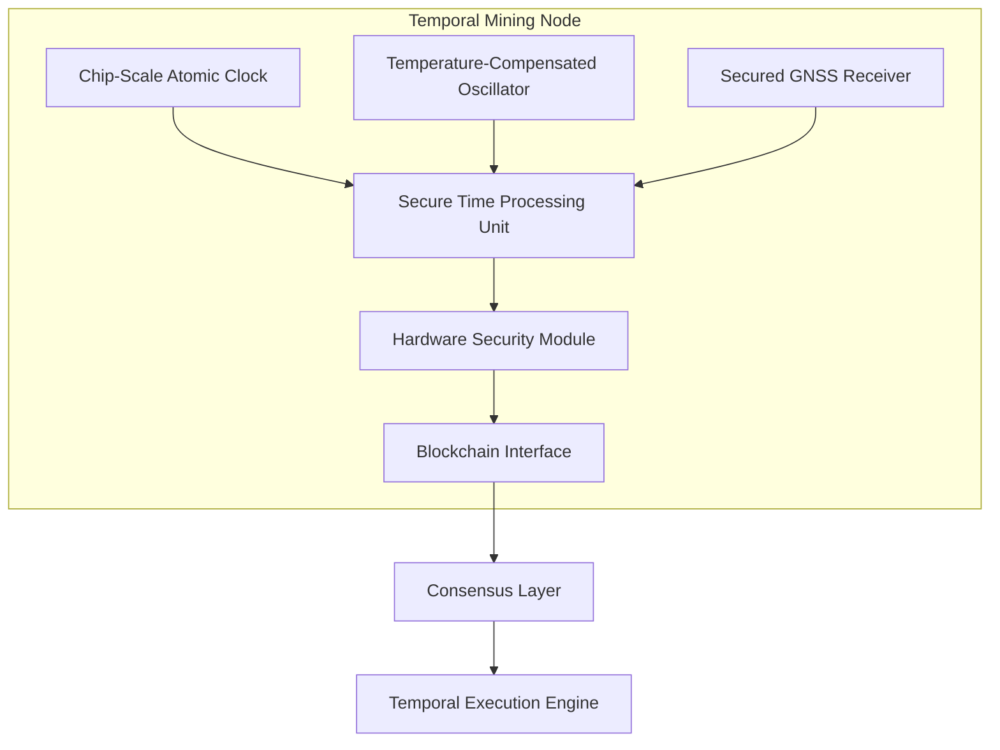

# Temporal Blockchain System: Advanced Framework Overview

## Executive Summary

The Temporal Blockchain System represents a fundamental paradigm shift in blockchain technology by solving the critical problem of trustless temporal awareness. By integrating hardware-secured timekeeping directly into the consensus mechanism, it transforms time from an external parameter into a first-class structural element within blockchain architecture.

This document provides a comprehensive technical overview of the enhanced framework, its components, mathematical foundations, and security properties. This overview builds upon the initial patent documentation and incorporates recent innovations and refinements.

## Core System Architecture

### 1. Hardware-Secured Time Layer

The foundation of the Temporal Blockchain is a network of specialized Temporal Mining Nodes (TMNs) equipped with:

- **Multi-layered Hardware Clock System**
  - Primary high-precision chip-scale atomic clock (CSAC)
  - Secondary temperature-compensated crystal oscillator (TCXO) for redundancy
  - Hardware-level time anomaly detection
  
- **Secure Time Processing Unit (STPU)**
  - Tamper-resistant hardware security module
  - Cryptographic time attestation generation
  - Time attestation verification circuits
  - Physical unclonable function (PUF) integration

- **Secured GNSS Receiver**
  - Anti-spoofing hardware
  - Signal authentication
  - Multi-constellation support (GPS, Galileo, GLONASS, BeiDou)
  - Jamming-resistant technologies

### 2. Temporal Consensus Layer

The Proof of Temporal Authority (PoTA) consensus mechanism:

- **Multi-layered Verification Process**
  - Cryptographic attestation verification
  - Cross-validation against network nodes
  - Historical temporal consistency checks
  
- **Byzantine Fault Tolerance with Temporal Weight**
  - Voting power weighted by temporal accuracy
  - Dynamic reputation adjustment
  - Slashing mechanisms for temporal manipulation

- **Temporal Reputation System**
  - Long-term accuracy tracking
  - Continuous calibration metrics
  - Verifiable reputation proofs

### 3. Temporal Execution Engine

- **Self-Triggering Smart Contracts**
  - Native temporal trigger primitives
  - Complex temporal conditions
  - Verifiable delay functions
  
- **Temporal State Management**
  - State transitions with temporal bounds
  - Time-locked state access
  - Time-based state expiry

- **Temporal Validation Layer**
  - Intrinsic timestamp verification
  - Temporal consistency checks
  - Time-bound execution enforcement

## Mathematical Foundations

### 1. Temporal Distributed Trust Architecture

For any claim $C$ at time $t$, the trust value $T(C,t)$ is determined by:

$$T(C, t) = \sum_{i=1}^{n} w_i(t) \cdot v_i(C, t) \cdot r_i(t)$$

Where:
- $w_i(t)$ represents the weight of TMN $i$ at time $t$
- $v_i(C, t)$ is the validation score from TMN $i$ for claim $C$ at time $t$
- $r_i(t)$ is the temporal reputation coefficient of TMN $i$ at time $t$

The system maintains diversity constraint:
$$D = -\sum_{i=1}^{n} p_i \log p_i > D_{min}$$

Where $p_i$ is the proportional influence of node type $i$.

### 2. Temporal Asymmetric Resistance

The system implements progressive resistance that increases non-linearly with power concentration:

$$R(a, t) = k \cdot \left(\frac{P(a, t)}{P_{baseline}(t)}\right)^\alpha \cdot TF(a, t)$$

Where:
- $R(a, t)$ is the systemic resistance encountered by actor $a$ at time $t$
- $P(a, t)$ is the power level of actor $a$ at time $t$
- $P_{baseline}(t)$ is the baseline power level at time $t$
- $\alpha > 1$ is the resistance exponent
- $TF(a, t)$ is a temporal factor based on $a$'s historical temporal accuracy

### 3. Temporal Attribution Chains

Leveraging hardware-secured timestamps creates attribution chains with unprecedented reliability:

$$A(I) = \{(s_1, r_1, t_1, h_1), (s_2, r_2, t_2, h_2), ..., (s_n, r_n, t_n, h_n)\}$$

Where each tuple $(s_i, r_i, t_i, h_i)$ represents:
- $s_i$: Source entity
- $r_i$: Relationship/transformation
- $t_i$: Hardware-verified timestamp from TMNs
- $h_i$: Hardware attestation cryptographic proof

The integrity of this attribution chain can be verified through:

$$V(A(I)) = \prod_{i=1}^{n} v(s_i, r_i, t_i, h_i, s_{i+1})$$

## Security Properties

### 1. Time-Manipulation Resistance

The system's resistance to temporal manipulation is quantified by:

$$R_{time}(a) = C \cdot (1 - e^{-k \cdot N_{diverse}}) \cdot \log(S_{temporal})$$

Where:
- $C$ is a system constant
- $N_{diverse}$ is the number of diverse TMNs in the network
- $S_{temporal}$ is the temporal stake required to participate in consensus

### 2. Long-term Time Security

For time security over extended periods:

$$S_{long}(t) = S_0 \cdot e^{-\lambda t} \cdot \sqrt{N_{TMN}(t)}$$

Where:
- $S_0$ is the initial security parameter
- $\lambda$ is the decay constant related to cryptographic security
- $N_{TMN}(t)$ is the projected number of active TMNs at time $t$

### 3. Offline Security Guarantee

For air-gapped operations, security is maintained through:

$$S_{offline}(t, \Delta t) = S_{base} \cdot (1 - \frac{\Delta t}{t_{max}})^2 \cdot e^{-\alpha \cdot \Delta t}$$

Where:
- $\Delta t$ is the duration of offline operation
- $t_{max}$ is the maximum secure offline period
- $\alpha$ is the drift coefficient of the atomic clocks

## Innovation Differentiators

1. **First-Class Temporal Awareness**: Unlike existing blockchains with external time oracles, time is a fundamental, intrinsic property of the system.

2. **Hardware-Secured Timing**: Physical security measures and cryptographic attestation provide unprecedented time integrity.

3. **Self-Triggering Contracts**: Autonomous execution without external triggers for time-sensitive operations.

4. **Offline Temporal Security**: Continued operation and security guarantees without network connectivity.

5. **Temporal Validation Primitives**: Built-in mechanisms for time-based validation and verification.

6. **Chrono-Resilient Architecture**: System-wide integrity maintained across both spatial and temporal dimensions.

This framework overview provides the foundation for understanding the Temporal Blockchain System's technical capabilities and mathematical underpinnings, serving as the basis for the detailed implementation specifications and application domains described in subsequent documentation.