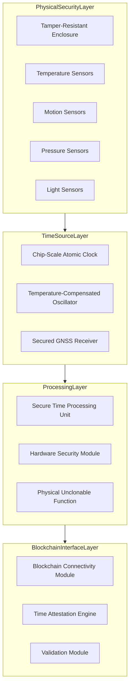

# Temporal Mining Node (TMN) Hardware Specification

This document provides the detailed technical specifications for Temporal Mining Nodes, the specialized hardware components that form the foundation of the Temporal Blockchain System. These specifications are designed to ensure secure, accurate, and tamper-resistant timekeeping within a decentralized network.

## 1. Hardware Architecture Overview

The Temporal Mining Node integrates multiple secure timing elements in a layered defense architecture to provide cryptographically verifiable time attestations.

## 2. Core Components Specifications

### 2.1 Primary Timing Elements

#### 2.1.1 Chip-Scale Atomic Clock (CSAC)

- **Type**: Cesium or Rubidium vapor cell atomic oscillator
- **Size**: Maximum dimensions of 40mm × 35mm × 11mm
- **Power Consumption**: < 120 mW at steady state
- **Frequency Stability**: 
  - Short-term (1s): ≤ 3×10⁻¹⁰
  - Medium-term (1 day): ≤ 1×10⁻¹²
  - Long-term (1 year): ≤ 3×10⁻¹⁰
- **Aging Rate**: < 3×10⁻¹⁰ per month
- **Temperature Sensitivity**: < 5×10⁻¹⁰ over operating temperature range
- **Operating Temperature Range**: -40°C to +85°C
- **Radiation Hardening**: Resistant to minimum 20 krad total ionizing dose

#### 2.1.2 Temperature-Compensated Crystal Oscillator (TCXO)

- **Type**: SC-cut quartz crystal with ovenized compensation
- **Frequency**: 10 MHz nominal frequency
- **Stability**: ≤ 5×10⁻⁸ over operating temperature range
- **Phase Noise**: ≤ -130 dBc/Hz at 100 Hz offset
- **Power Consumption**: < 100 mW at steady state
- **Warm-up Time**: < 30 seconds to specified stability
- **Aging**: < 1×10⁻⁷ per year

#### 2.1.3 Secured GNSS Receiver

- **Supported Systems**: GPS, Galileo, GLONASS, BeiDou
- **Channels**: Minimum 72 concurrent channels
- **Anti-Spoofing Features**:
  - Signal authentication processing
  - Jamming detection and mitigation
  - Spoofing detection algorithms
  - Multi-constellation cross-verification
- **Security Features**:
  - Signed firmware with secure boot
  - Encrypted signal processing
  - Anomaly detection for timing signals
- **Acquisition Sensitivity**: -160 dBm
- **Positioning Accuracy**: < 2.5m CEP
- **Timing Accuracy**: < 20 ns RMS (1-sigma) to UTC

### 2.2 Secure Processing Elements

#### 2.2.1 Secure Time Processing Unit (STPU)

- **Architecture**: Custom silicon with secure execution environment
- **Clock Management**:
  - Clock synchronization circuits
  - Time anomaly detection
  - Drift compensation algorithms
- **Security Features**:
  - Side-channel attack resistance
  - Fault injection detection
  - Runtime integrity monitoring
- **Performance**:
  - Processing time for attestation: < 10 ms
  - Verification time for external attestations: < 5 ms
- **Cryptographic Capabilities**:
  - Hardware-accelerated signature generation/verification
  - Temporal nonce generation
  - Time-bound key derivation

#### 2.2.2 Hardware Security Module (HSM)

- **Security Certification**: FIPS 140-3 Level 4 or equivalent
- **Key Management**:
  - Secure key generation
  - Temporal key derivation functions
  - Key usage counting and time-bound restrictions
- **Cryptographic Algorithms**:
  - Symmetric: AES-256, ChaCha20
  - Asymmetric: RSA-4096, ECDSA (P-384, P-521)
  - Hash Functions: SHA-512, SHA3-256, SHA3-512
  - Post-Quantum: CRYSTALS-Dilithium, CRYSTALS-Kyber
- **Physical Security Features**:
  - Active mesh with tamper detection
  - Environmental monitoring
  - Self-destruction capabilities for keys under attack

#### 2.2.3 Physical Unclonable Function (PUF)

- **Type**: Silicon-based challenge-response PUF
- **Entropy**: Minimum 256-bit effective entropy
- **Reliability**: < 10⁻⁶ bit error rate with error correction
- **Uniqueness**: Inter-device hamming distance > 45%
- **Challenge-Response Pairs**: Capacity for > 10⁶ unique pairs
- **Tamper Evidence**: Permanent alteration upon physical tampering attempts

### 2.3 Physical Security Components

#### 2.3.1 Tamper-Resistant Enclosure

- **Construction**: Multi-layer composite with conductive mesh
- **Penetration Resistance**: Minimum 30 minutes against laboratory tools
- **Environmental Protection**: IP67 rating (dust-tight and waterproof)
- **Tamper Detection**:
  - Volumetric sensors
  - Breach detection mesh
  - Microdrilling detection
- **Response Mechanisms**:
  - Key zeroization upon tamper detection
  - Secure audit logging of tamper attempts
  - Optional: epoxy potting for critical components

#### 2.3.2 Environmental Sensors

- **Temperature Sensors**: ±0.5°C accuracy across operating range
- **Voltage Monitors**: Detection of glitching and power manipulation
- **Light Sensors**: Detection of enclosure breaches
- **Motion Sensors**: 6-axis accelerometer/gyroscope for movement detection
- **Pressure Sensors**: Atmospheric pressure monitoring for altitude changes

## 3. Performance Specifications

### 3.1 Timing Performance

- **Time Accuracy to UTC**: < 50 ns (with GNSS), < 1 μs (free-running)
- **Holdover Performance**:
  - 1 hour: < 100 ns drift
  - 24 hours: < 1 μs drift
  - 7 days: < 10 μs drift
  - 30 days: < 100 μs drift
- **Attack Detection Latency**: < 100 ms for timing attacks
- **Attestation Accuracy**: Uncertainty quantification < 10 ns

### 3.2 Security Performance

- **Side-Channel Resistance**: EAL 6+ or equivalent
- **Key Protection**: Hardware-enforced isolation of temporal attestation keys
- **Temporal Proof Generation**: < 50 ms per proof
- **Proof Verification**: < 20 ms per proof
- **Attack Surface Reduction**: Minimal external interfaces, fully hardened

### 3.3 Blockchain Performance

- **Block Time Accuracy**: ±5 ms maximum deviation from consensus time
- **Validation Rate**: > 1000 temporal proofs per second
- **Network Synchronization**: Automatic re-synchronization within 60 seconds after connection
- **Offline Operation**: Secure operation for up to 30 days without network connectivity

## 4. Interface Specifications

### 4.1 Network Interfaces

- **Primary Interface**: Ethernet 1 Gbps (RJ45)
- **Secondary Interface**: Wi-Fi 6E (IEEE 802.11ax)
- **Backup Interface**: Cellular LTE/5G modem (optional)
- **Air-Gap Support**: USB 3.1 Type-C for offline transaction signing
- **Protocol Support**: TCP/IP, UDP, HTTPS, WebSockets, custom Temporal Blockchain Protocol

### 4.2 Management Interfaces

- **Local Console**: USB Type-C with console redirection
- **Web Interface**: HTTPS-based management (two-factor authentication required)
- **API**: RESTful and gRPC interfaces for automation
- **Monitoring**: SNMP v3, Syslog over TLS

### 4.3 Time Synchronization Interfaces

- **PTP/IEEE 1588**: Precision Time Protocol support (optional)
- **NTP Server**: Secure NTP server functionality (optional)
- **External Reference**: SMA connector for external 10 MHz reference (optional)
- **1PPS Output**: SMA connector for 1 pulse-per-second output (optional)

## 5. Environmental Specifications

- **Operating Temperature**: -20°C to +60°C
- **Storage Temperature**: -40°C to +85°C
- **Humidity**: 5% to 95% (non-condensing)
- **Altitude**: Up to 3,000 meters
- **Shock Resistance**: MIL-STD-810H, Method 516.8
- **Vibration Resistance**: MIL-STD-810H, Method 514.8

## 6. Power Specifications

- **Input Voltage**: 100-240 VAC, 50-60 Hz or 12-48 VDC
- **Power Consumption**:
  - Idle: < 15 W
  - Normal Operation: < 35 W
  - Peak: < 50 W
- **Battery Backup**: Minimum 4 hours of operation during power failure
- **Power Protection**: Surge protection, EMI/RFI filtering

## 7. Regulatory Compliance

- **Electromagnetic Compatibility**: FCC Part 15, CISPR 32/EN 55032
- **Safety**: IEC 60950-1, UL 60950-1
- **Environmental**: RoHS, WEEE compliant
- **Cryptographic Validation**: FIPS 140-3, Common Criteria EAL 4+

## 8. Physical Specifications

- **Form Factor**: 1U rack-mountable or desktop enclosure
- **Dimensions**: 438mm × 330mm × 44mm (1U rack) or 250mm × 200mm × 60mm (desktop)
- **Weight**: < 5 kg (rack) or < 3 kg (desktop)
- **Cooling**: Passive cooling (no fans) for silent operation and reliability

## 9. Reliability Specifications

- **MTBF**: > 100,000 hours
- **Design Life**: Minimum 10 years
- **Warranty**: 5 years standard, with extended options
- **Serviceability**: Tamper-evident field-replaceable modules

## 10. Implementation Variants

Three implementation variants are defined to accommodate different deployment scenarios:

### 10.1 TMN Enterprise Edition

- Full rack-mounted implementation with all features
- Redundant power supplies and network interfaces
- Extended environmental range
- Suitable for data centers and high-security environments

### 10.2 TMN Standard Edition

- Desktop form factor with core functionality
- Single power supply with battery backup
- Standard environmental range
- Suitable for business and institutional deployments

### 10.3 TMN Embedded Edition

- Miniaturized form factor for integration
- Reduced feature set but full security capabilities
- Extended temperature range
- Suitable for IoT gateways and embedded applications

## 11. Security Certification Requirements

All TMN implementations must undergo the following security certifications:

1. **FIPS 140-3 Level 3+** for cryptographic modules
2. **Common Criteria EAL 4+** for overall security architecture
3. **Penetration testing** by minimum three independent security firms
4. **Side-channel attack resistance** verification
5. **Timing attack resistance** verification

## 12. Key Security Features

1. **Secure Boot**: Multi-stage signature verification for firmware integrity
2. **Firmware Updates**: Cryptographically signed, atomic updates with rollback protection
3. **Remote Attestation**: TPM-based remote attestation of software state
4. **Key Isolation**: Hardware separation of blockchain keys from attestation keys
5. **Audit Logging**: Tamper-evident logging of all security events
6. **Self-Tests**: Continuous and startup self-tests for all security functions
7. **Secure Decommissioning**: Secure key deletion and factory reset capabilities

This hardware specification provides the foundation for the secure, accurate, and tamper-resistant timekeeping required by the Temporal Blockchain System. The multi-layered security approach, combined with high-precision timing elements, ensures the integrity of temporal attestations even in adversarial environments.