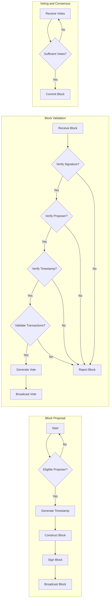
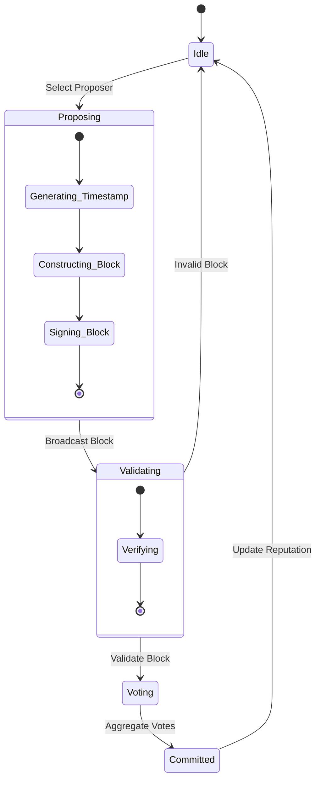

# Temporal Blockchain Consensus Protocol: Proof of Temporal Authority (PoTA)

This document provides a detailed technical specification of the Proof of Temporal Authority (PoTA) consensus mechanism, the core protocol that governs block creation, validation, and network-wide time synchronization in the Temporal Blockchain System.

## 1. Overview

PoTA is a novel consensus algorithm that leverages the hardware-secured timekeeping capabilities of Temporal Mining Nodes (TMNs) to achieve Byzantine fault tolerance and trustless temporal awareness. It combines elements of Proof-of-Stake and Proof-of-Authority, but with a critical emphasis on verifiable temporal accuracy.  Key features include:

*   **Hardware-Rooted Time:** Timestamps are derived from the TMNs' multi-layered clock systems and cryptographically attested by their Secure Time Processing Units (STPUs).
*   **Temporal Reputation:** Nodes earn reputation based on the historical accuracy of their timestamps and participation.
*   **Weighted Voting:** Voting power is proportional to a node's temporal reputation and, optionally, staked tokens.
*   **Byzantine Fault Tolerance:** The system remains secure and functional even if a fraction of nodes are malicious or faulty.
*   **Dynamic Adjustment:** Consensus parameters (e.g., tolerance windows) adapt to network conditions.
*   **Slashing:**  Penalties are imposed for nodes that submit inaccurate timestamps or attempt to manipulate the consensus process.

## 2. Algorithm Description

### 2.1 Block Proposal

1.  **Eligibility Check:**  At the beginning of each block interval, a set of eligible block proposers is determined. Eligibility can be based on:
    *   **Temporal Reputation:** Only nodes with a reputation score above a certain threshold are eligible.
    *   **Stake (Optional):**  A node's stake can further increase its probability of being selected.
    *   **Random Selection (with VRF):**  A Verifiable Random Function (VRF) can be used to select proposers, weighted by reputation and/or stake.

2.  **Timestamp Generation:** The selected proposer generates a cryptographically attested timestamp using its STPU and multi-layered clock system.  This timestamp is the core of the proposed block.

3.  **Block Construction:** The proposer creates a new block containing:
    *   The attested timestamp.
    *   A hash of the previous block.
    *   A set of valid transactions.
    *   The proposer's public key.
    *   A cryptographic signature of the entire block (including the timestamp).
    *   The proposer's current temporal reputation score.

4.  **Block Broadcast:** The proposer broadcasts the proposed block to the network.

### 2.2 Block Validation

When a node receives a proposed block, it performs the following validation steps:

1.  **Signature Verification:**  Verify the proposer's signature on the block.
2.  **Proposer Eligibility:** Check that the proposer was eligible to propose a block at that time.
3.  **Timestamp Attestation Verification:**
    *   Verify the cryptographic attestation of the timestamp using the proposer's public key.
    *   Check that the timestamp is within an acceptable range, relative to the node's own hardware-secured clock.  This range (tolerance window) is dynamically adjusted based on network conditions and historical performance.
4.  **Temporal Consistency Check:**
    *  Verify it isn't in the future too far.
    *   Verify that the timestamp is consistent with the timestamps of previous blocks (e.g., it's not significantly earlier than the previous block's timestamp).
    *   Check for any suspicious temporal patterns (e.g., large jumps in time).
5.  **Transaction Validation:**  Verify the validity of all transactions included in the block.
6.  **Double-Spending Check:** Ensure that no transactions in the block attempt to double-spend funds.
7.  **Block Hash Validation** Check for any conflicts against the other hashes; ensure they reconcile.

### 2.3 Voting

1.  **Vote Generation:** If a node validates a block, it generates a signed vote for that block.  The vote includes:
    *   The block hash.
    *   The validator's public key.
    *   A timestamp (attested by the validator's STPU).
    *   A cryptographic signature.

2.  **Vote Weighting:** Each vote is weighted by the validator's:
    *   **Temporal Reputation:** Higher reputation leads to a larger vote weight.
    *   **Stake (Optional):** Staked tokens can further increase vote weight.  A combined weighting function could be used:

    $$W(a) = \alpha \cdot R(a, t) + (1 - \alpha) \cdot S(a, t)$$

    where:

    *   $W(a)$ is the voting weight of agent $a$.
    *   $R(a, t)$ is the temporal reputation of agent $a$ at time $t$.
    *   $S(a, t)$ is the stake of agent $a$ at time $t$ (normalized to a 0-1 range).
    *   $\alpha$ is a parameter that controls the relative importance of reputation vs. stake (0 ≤ α ≤ 1).

3.  **Vote Aggregation:** Votes are aggregated by the network.  A block is considered *committed* when it receives votes exceeding a certain threshold (e.g., 2/3 + 1 of the total voting power).

### 2.4 Reputation Scoring

The Temporal Reputation System is crucial for incentivizing accurate timekeeping and deterring manipulation.

*   **Reputation Update Rule:**  A node's reputation is updated after each block is committed. A possible update rule is:

    $$R(a, t+1) = R(a, t) + \beta \cdot (Accuracy(a, t) - R(a, t)) - \gamma \cdot Penalty(a, t)$$
Where:
 * $R(a,t)$: Reputation.
 *  $\beta$: Learning Rate for agreement.
 * $\gamma$: Penalty "Harshness" Coefficient

    *   **Accuracy(a, t):**  Measures the accuracy of the node's timestamps in the block at time `t`. This could be calculated as:

        $$Accuracy(a, t) = 1 - \frac{|T_{node}(a, t) - T_{consensus}(t)|}{ToleranceWindow(t)}$$

        where:

        *   $T_{node}(a, t)$ is the timestamp provided by node `a` in the block at time `t`.
        *   $T_{consensus}(t)$ is the final consensus timestamp for the block at time `t`.
        *   $ToleranceWindow(t)$ is the acceptable tolerance window at time `t`.
   *  Values *too early* can also count as "inaccurate," especially if they exceed network tolerances.

    *   **Penalty(a, t):**  A penalty applied if the node submitted an invalid timestamp or voted for an invalid block. This could be a fixed value or a function of the severity of the infraction.

*   **Reputation Decay (Optional):**  A small decay factor can be applied to reputation over time to encourage continuous accurate participation.
*   **Reputation Bounds:** Reputation scores are bounded within a defined range (e.g., 0 to 1).

### 2.5 Slashing

Nodes that engage in malicious behavior are subject to slashing:

*   **Temporal Manipulation:**  Submitting blocks with significantly inaccurate timestamps.
*   **Double Voting:**  Voting for multiple conflicting blocks at the same height.
*   **Censorship:**  Refusing to include valid transactions.
*   **Equivocation:** Proposing multiple blocks at the same time step.

Slashing penalties can include:

*   **Reputation Loss:**  A significant reduction in the node's reputation score.
*   **Stake Confiscation (if staking is used):**  Loss of a portion or all of the node's staked tokens.
*   **Temporary or Permanent Exclusion:**  Banning the node from participating in consensus.

## 3. Mathematical Formalization

### 3.1 Byzantine Fault Tolerance

PoTA provides Byzantine fault tolerance up to a certain fraction of malicious or faulty nodes. Let:

*   $n$ be the total number of validators.
*   $f$ be the maximum number of faulty validators.
*   $W_{total}$ be the total voting power.
*   $W_{faulty}$ be the total voting power of faulty validators.

The system is considered Byzantine fault-tolerant if:

$$W_{faulty} < \frac{1}{3} W_{total}$$

This ensures that faulty nodes cannot control enough voting power to disrupt the consensus process. The threshold can also depend on reputation factors: where even a slightly lower level than 1/3 total "power," if all reputation levels combined, from actors later demonstrated as *malicious*!

### 3.2 Temporal Accuracy

The overall temporal accuracy of the system is measured by the deviation of the consensus timestamp from "true" time (as determined by the TMNs' atomic clocks).  Let:

*   $T_{consensus}(t)$ be the consensus timestamp for block at time `t`.
*   $T_{true}(t)$ be the "true" time at time `t`.

The temporal accuracy can be quantified as:

$$Accuracy_{system}(t) = 1 - \frac{|T_{consensus}(t) - T_{true}(t)|}{MaximumDeviation}$$

where `MaximumDeviation` is a system-wide parameter defining the maximum acceptable deviation.

## 4. Security Analysis

### 4.1 Potential Attack Vectors

*   **Time Manipulation Attacks:**  Malicious nodes attempt to shift the consensus time forward or backward.
*   **Sybil Attacks:**  An attacker creates multiple identities to gain a disproportionate influence on consensus.
*   **Long-Range Attacks:**  An attacker attempts to rewrite the blockchain history by accumulating voting power over time.
*   **Censorship Attacks:**  Nodes collude to exclude certain transactions from blocks.
*   **Eclipse Attacks:** An attacker isolates a node from the rest of the network to feed it false information.
*   **Bribery Attacks** Other "attacks", but through "paying off" validators and other "stakeholders": this represents some form of collusion.

### 4.2 Mitigation Strategies

*   **Hardware-Secured Time:** Makes it extremely difficult to forge timestamps.
*   **Temporal Reputation:**  Disincentivizes time manipulation by penalizing inaccurate nodes.
*   **Weighted Voting:** Reduces the influence of individual nodes, making Sybil attacks more difficult.
*   **Stake-Based Security (Optional):** Requires attackers to control a significant amount of stake, increasing the cost of an attack.
*   **Random Proposer Selection (with VRF):** Prevents attackers from predicting and targeting block proposers.
*   **Network-Level Defenses:**  Robust peer-to-peer networking protocols and intrusion detection systems mitigate Eclipse attacks.
*   **Slashing:**  Severe penalties deter malicious behavior.
*   **Multi-path Temporal Validation:** Validates time through different methods on the device for higher integrity assurance.

## 5. Performance Analysis

*   **Block Time:** The target block time (e.g., 1 second, 10 seconds) is a configurable parameter.
*   **Transaction Throughput:**  Depends on block size, transaction size, and the efficiency of the validation process. The system is designed for high throughput, leveraging hardware acceleration for cryptographic operations.
*   **Scalability:**  PoTA is designed to scale to a large number of validators. The use of weighted voting and reputation helps to maintain efficiency even with a large network. Techniques like sharding can be considered for further scalability.

## 6. Diagrams

