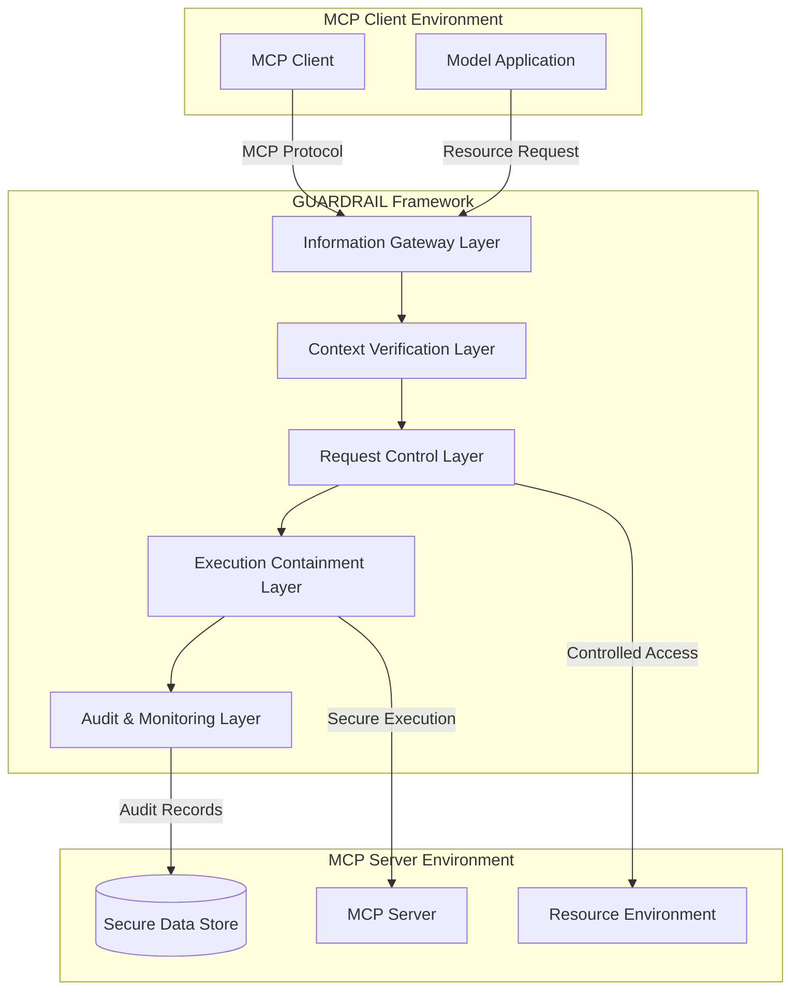
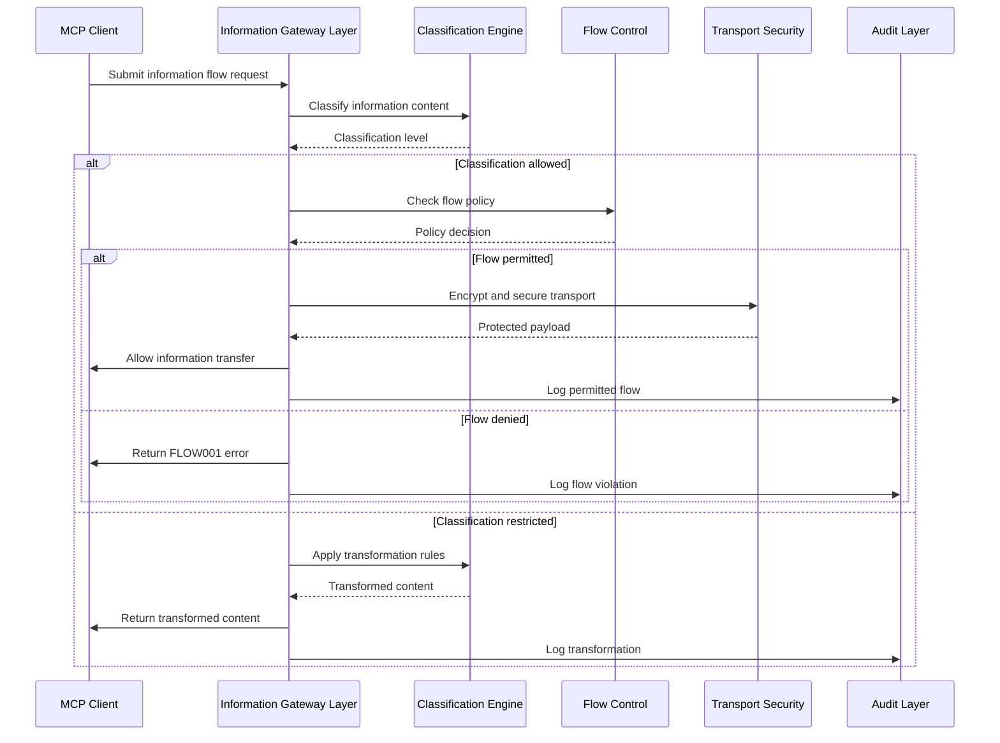
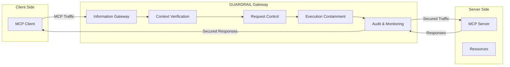
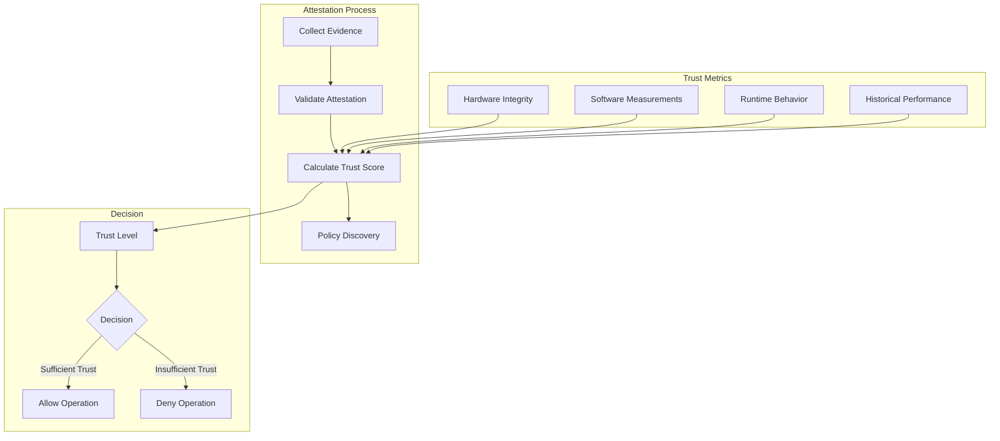

# GUARDRAIL: Securing Model Context Protocol

In today's rapidly evolving landscape of Large Language Model (LLM) applications, the need for robust security frameworks has never been more critical. We're excited to introduce **GUARDRAIL**, our comprehensive security framework specifically designed to address information flow security challenges in LLM application ecosystems that utilize the Model Context Protocol (MCP).

## What is GUARDRAIL?

GUARDRAIL (Gateway for Unified Access, Resource Delegation, and Risk-Attenuating Information Limits) is a security framework that implements a layered approach to protecting information flows between MCP clients and servers. It addresses both infiltration and exfiltration risks while maintaining the functionality and performance of the MCP ecosystem.

## Core Architecture

GUARDRAIL implements a hierarchical security architecture with five distinct layers, each providing specific protections:

### 1. Information Gateway Layer (IGL)

The Information Gateway Layer manages all information flows entering or leaving the system. It classifies content based on sensitivity levels (PUBLIC, INTERNAL, SENSITIVE, RESTRICTED) and enforces flow policies that determine what information can move between different security boundaries.

### 2. Context Verification Layer (CVL)

This layer establishes and validates the trustworthiness of execution environments. It collects attestation evidence, calculates trust scores, and discovers applicable security policies based on the context. This ensures that security decisions are made with awareness of the operational environment.

### 3. Request Control Layer (RCL)

The Request Control Layer enforces capability-based access control for resources. It validates capability tokens, checks authorizations against requested operations, and enforces resource quotas and operational limits to prevent abuse.

### 4. Execution Containment Layer (ECL)

This layer isolates operations and enforces resource limitations to prevent one component from affecting others. It implements memory isolation, system call filtering, and network controls to contain potential security breaches.

### 5. Audit and Monitoring Layer (AML)

The Audit and Monitoring Layer records security-relevant events in a tamper-evident manner. It implements anomaly detection algorithms to identify patterns indicative of attacks and supports incident response with detailed forensic information.

## Information Flow Control

One of GUARDRAIL's most powerful features is its sophisticated information flow control mechanism. This sequence diagram illustrates how information flows are managed:

This mechanism ensures that all information flows are explicitly authorized, appropriately protected, and fully audited, implementing the principle of data minimization.

## Deployment Models

GUARDRAIL supports three deployment models to fit different operational requirements:

### 1. Embedded Model

In this model, GUARDRAIL components are integrated directly into the host application, providing security with minimal external dependencies. This is suitable for standalone applications or development environments.

### 2. Gateway Model

GUARDRAIL functions as a standalone security gateway where all MCP traffic passes through a centralized point of control. This model provides comprehensive policy enforcement at network boundaries and is ideal for enterprise environments with strict security requirements.

### 3. Service Mesh Model

In this model, GUARDRAIL components are deployed as sidecars in Kubernetes pods, with each client and server having its own dedicated security instance. A central control plane manages policies and coordinates security, making this model optimized for cloud-native and microservices architectures.

## Technical Implementation

GUARDRAIL is built on several advanced technical concepts:

### Capability-Based Access Control

GUARDRAIL implements a capability-based access control system where access rights are represented as unforgeable tokens that explicitly authorize specific operations. This model supports:

- **Capability Attenuation**: Derived capabilities can only reduce, never expand, permissions
- **Controlled Delegation**: Capabilities can be delegated to other components with additional constraints
- **Capability Composition**: Multiple capabilities can be combined using defined operators

### Trust Scoring and Attestation

The Context Verification Layer uses a Bayesian trust model to calculate confidence in execution environments:

### Tamper-Evident Audit Chain

All security events are recorded in a cryptographically protected audit chain that prevents unauthorized modifications:

- Records are organized in a Merkle tree structure for efficient verification
- Cryptographic proofs enable validation of historical records
- Distributed verification ensures redundancy and independent confirmation

## Example Usage: Securing Financial Data in an MCP Environment

Let's look at a practical example of how GUARDRAIL can be used to secure financial data in an MCP environment:

### Scenario

A financial services company uses an LLM application to analyze customer financial data and generate investment recommendations. The application connects to multiple data sources, including customer profiles, transaction histories, and market data. GUARDRAIL is deployed to protect sensitive financial information while allowing the LLM to provide useful recommendations.

### Implementation

1. **Information Classification**:
   - Customer financial data is classified as RESTRICTED
   - General market data is classified as PUBLIC
   - Aggregated statistics are classified as INTERNAL

2. **Flow Policies**:
   - RESTRICTED data can only flow between authenticated, high-trust components
   - Transformations are applied to convert RESTRICTED data to INTERNAL by removing personally identifiable information
   - Only PUBLIC and transformed INTERNAL data can be sent to the LLM

3. **Capability Configuration**:
   - The LLM service receives capabilities to access transformed financial data
   - Access is limited to specific aggregated views with no raw customer data
   - Capabilities are time-limited and automatically expire after the analysis session

4. **Audit and Monitoring**:
   - All data access is logged with detailed context
   - Pattern analysis detects unusual data access patterns
   - Regular compliance reports are generated for regulatory review

### Results

With GUARDRAIL in place, the financial service can leverage powerful LLM capabilities while ensuring that:

- Raw customer financial data never leaves secure environments
- The LLM only receives anonymized, aggregated data
- All data access is monitored and auditable
- Compliance requirements for financial data handling are met
- The risk of data exfiltration is significantly reduced

## Conclusion

GUARDRAIL represents a significant advancement in securing LLM applications that use the Model Context Protocol. By implementing a comprehensive, layered security approach with sophisticated information flow control and capability-based access mechanisms, it addresses critical security challenges while preserving the functionality and performance of MCP ecosystems.

Whether deployed as an embedded component, a standalone gateway, or part of a service mesh architecture, GUARDRAIL provides robust protection against both infiltration and exfiltration risks. Its flexible design makes it suitable for a wide range of applications, from high-security enterprise environments to cloud-native deployments.

As LLM applications continue to process increasingly sensitive information, frameworks like GUARDRAIL will be essential to maintaining security and trust in these powerful technologies.

For more information on implementing GUARDRAIL in your environment, contact our security team or visit our GitHub repository.