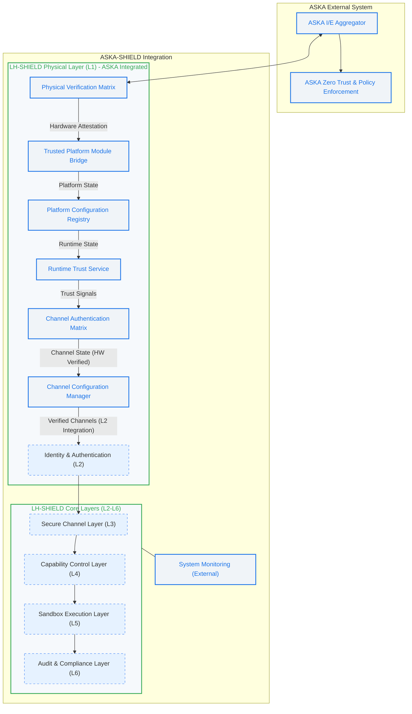

**Description of LH-SHIELD in ASKA Integration Diagram:**

This diagram illustrates how LH-SHIELD's Physical Layer (L1) is deeply integrated into the larger ASKA system.  It highlights that, within ASKA, LH-SHIELD L1 becomes *specifically* the interface to ASKA's broader hardware-level security framework.

*   **LH-SHIELD L1 as ASKA Physical Verification Layer:** The `LH-SHIELD Physical Layer (L1) - ASKA Integrated` subgraph represents how LH-SHIELD's L1 components are tailored for ASKA integration. The key component becomes `Physical Verification Matrix (PVM)`, which acts as the explicit interface point to ASKA's `I/E Aggregator`.
*   **Hardware Attestation within ASKA Trust Framework:** Within L1 (now within ASKA context), the `TPM Bridge`, `Platform Configuration Registry (PCR)`, and `Runtime Trust Service (RTS)` components from LH-SHIELD's L1 *remain*.  They still provide hardware attestation, platform state measurement, and runtime trust evaluation.  However, *now*, their output (`Runtime State` and `Trust Signals`) flows directly *into* ASKA's broader security framework, specifically into `Trust Vector Matrix (TVM)` and `Channel Authentication Matrix (CAM)`.
*   **ASKA I/E Aggregator Interaction (PVM):**  `Physical Verification Matrix (PVM)` is shown explicitly interacting with ASKA's `I/E Aggregator` via a bi-directional arrow `AIE <--> PVM`. This symbolizes the direct hardware-level verification integration between LH-SHIELD L1 and ASKA's external system boundary – physical-layer security directly informing ASKA’s ingress/egress enforcement.
*   **Hardware-Verified Channels and Integration with LH-SHIELD Core:** `Channel Authentication Matrix (CAM)` and `Channel Configuration Manager (CCM)` still perform channel verification functions, but crucially, the `CCM` now outputs "Verified Channels (HW Verified)" to the *rest of LH-SHIELD Core Layers* – specifically to L2 (`L2[LH-SHIELD Identity & Authentication (L2)]`). This connection  `CCM -->|Verified Channels (L2 Integration)| L2` illustrates that LH-SHIELD's L2 and higher layers benefit from the hardware-backed channel verification provided by the integrated L1 (within ASKA framework).
*   **LH-SHIELD Core Layers (L2-L6) Remain Structurally LH-SHIELD:** The `LH-SHIELD Core Layers (L2-L6)` subgraph (dashed box, greyed out style to visually de-emphasize as focus is L1 integration *into* ASKA in this diagram) visually represents that the *structure* of L2, L3, L4, L5, and L6 from LH-SHIELD *largely remains* within the ASKA integration.  These layers are still LH-SHIELD protocol implementations for identity, secure channels, capabilities, sandbox, and audit – however, they are *enhanced and underpinned* by the ASKA-integrated Physical Layer L1. Dashed lines connecting these core LH-SHIELD layers signify they are conceptually present as LH-SHIELD layers, but the diagram's primary *focus* and detailed representation is on L1 integration into ASKA's framework.

**Key Takeaways from ASKA Integration Diagram:**

*   **LH-SHIELD L1 as ASKA's Physical Security Extension:** In this integrated view, LH-SHIELD's Physical Layer becomes a specialized, ASKA-integrated physical verification and attestation layer within the broader ASKA security architecture.
*   **Hardware-Backed Trust Amplifies LH-SHIELD Security:** ASKA’s hardware-level verification and trust signals from the integrated LH-SHIELD L1 *significantly strengthen* the security of all higher layers of LH-SHIELD (L2-L6) when deployed within an ASKA-protected system.
*   **Hybrid Approach - Best of Both Worlds:** The ASKA integration represents a *hybrid* architecture that combines ASKA's broader external system security and hardware-level verification focus with the principled layered protocol architecture of LH-SHIELD, achieving a synergistic security posture – hardware-rooted trust underpinning a robust layered software security framework.

