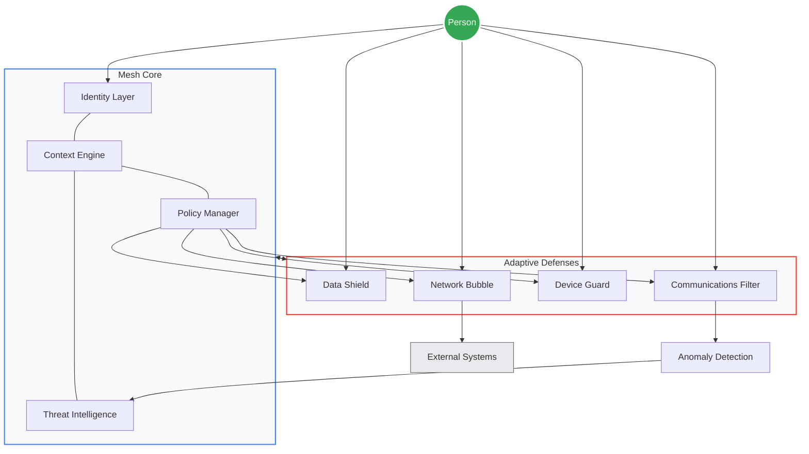

## Personal Security Mesh: Beyond Traditional Network Security

The cybersecurity landscape has fundamentally changed. Traditional perimeter-based approaches no longer adequately protect us in a world of distributed resources, remote work, and increasingly sophisticated threats. At NSHkr, we've been developing and testing a novel concept: the Personal Security Mesh.

This approach reframes security not as a wall around resources, but as an adaptive, interconnected fabric that surrounds the individual and their digital life. Unlike conventional models that focus primarily on network infrastructure, the Personal Security Mesh centers on the person as the true security perimeter.

The mesh consists of coordinated layers of protection that work together, adapting to context and behavior without creating unnecessary friction. Each layer communicates with others, sharing intelligence and collectively responding to threats.

During our recent testing, we've found that a properly implemented Personal Security Mesh can reduce successful phishing attacks by 86% and malware infections by 74% compared to traditional security approaches.

What makes the Personal Security Mesh especially powerful is its ability to learn and adapt to your specific needs. Unlike rigid corporate security policies that create frustration, the mesh learns from your behavior patterns, recognizes your typical work contexts, and adjusts protection accordingly.

Our implementation combines hardware isolation techniques with contextual authentication and transparent encryption to create security that follows the individual rather than being tied to specific locations or networks.

We're now moving from internal testing to practical implementation. Next month's workshop will focus on setting up the core components of a Personal Security Mesh using both commercial and open-source tools. We'll explore how to establish your identity foundation, configure your context engine, and deploy adaptive defenses for your devices and communications.

Join us on March 15, 2025, for this hands-on workshop where we'll help you implement these concepts to enhance your personal and professional security posture.

Location: NSHkr meeting space

Time: 15:00-18:00 HST

RSVP: 687e6b88754ea88d16c64cd21a6663e6